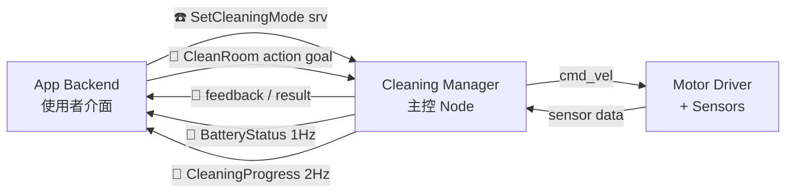
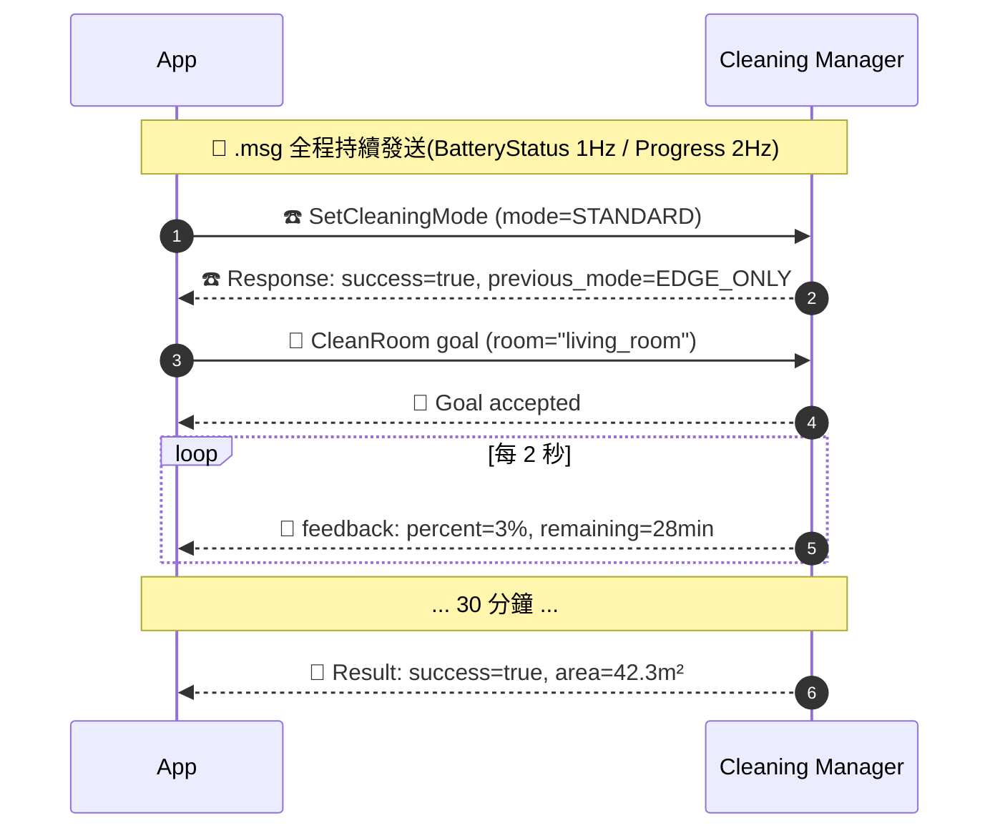
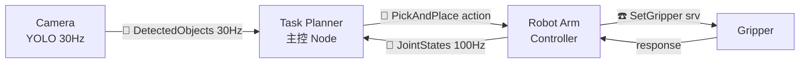
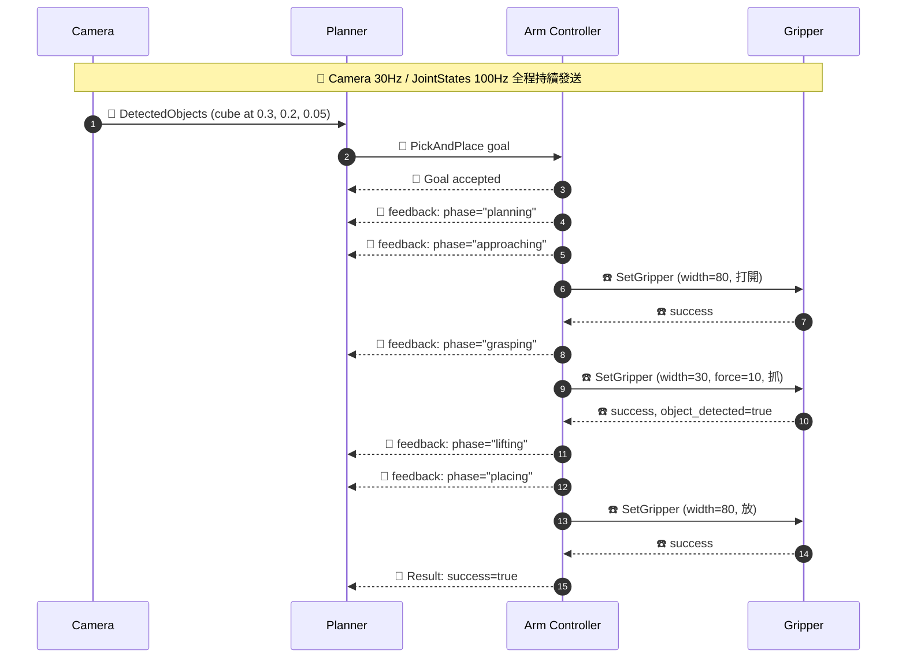

# 介面選型指南:.msg / .srv / .action 怎麼選

> 「我這個情境該用哪一種?」「真實專案會三種都用嗎?」「該不該自訂?」
> 這份文件回答上面三個問題。

**讀者**:已經學過 [Phase 08 自訂介面](phase-08-custom-interfaces/) 的「**怎麼定義**」,現在要決定「**該定義什麼**」。

**閱讀路徑**:
- 想看一個系統怎麼搭配 → [兩個整合情境](#-三個檔案怎麼搭配兩個真實系統情境)
- 想知道業界比例 → [真實專案會用到幾種](#-真實專案會用到幾種別以為都要全部自訂)
- 想要 30 秒判斷 → [4 問題決策樹](#-4-問題決策樹)

---

## 📌 30 秒摘要

| 檔案 | 用途 | 時間尺度 | 業界佔比 |
|------|------|---------|---------|
| 📡 `.msg` | 持續廣播狀態 | 永遠在發 | 80%+ |
| ☎️ `.srv` | 單次請求 + 立刻回 | < 1 秒 | 10–15% |
| 🎯 `.action` | 長任務 + 進度 + 可取消 | 秒到分鐘 | 1–5% |

**核心原則**:**選最簡單夠用的那個**。能用 .msg 不用 .srv,能用 .srv 不用 .action。

---

## 🎬 三個檔案怎麼搭配?兩個真實系統情境

光看結構不夠,**看一個系統內三種檔案怎麼協作**才會懂。下面兩個情境各展示一台真實機器人怎麼用 `.msg` + `.srv` + `.action` 拼成完整系統。

---

### 🧹 情境 1:掃地機器人(Mobile)

**任務**:使用者按 app 上的「**清掃客廳**」,機器人從充電座出發、避障、清掃 30 分鐘、回充電座。

#### 系統架構



#### 三個檔案各扮演什麼角色

##### 📡 `.msg` — 持續廣播狀態(讓 UI、紀錄、其他 Node 都看得到)

`BatteryStatus.msg` — 1 Hz 持續發
```
std_msgs/Header header
float32 voltage              # 24.5
float32 percentage           # 0.0–1.0,UI 用來畫電池圖示
uint8 charging_state         # 0=放電 1=充電 2=滿電
float32 estimated_minutes    # 預估還能跑多久
```

`CleaningProgress.msg` — 2 Hz 持續發
```
std_msgs/Header header
float32 area_cleaned_m2      # 已清掃面積
float32 area_total_m2        # 房間總面積
float32 percent_complete     # 0.0–1.0
geometry_msgs/Point2D current_position
uint32 dirt_collected_grams
```

**為什麼這兩個是 .msg**:
- 多個訂閱者(App UI、log 系統、Nav2 用電量決定要不要先回充)各自取用
- 高頻、持續、漏一筆下一筆會到
- 改用 .srv 會讓**每個訂閱者都要主動 poll**,server 被打爆

##### ☎️ `.srv` — 切換模式(瞬間決策、要立刻得到 confirm)

`SetCleaningMode.srv`
```
# Request
uint8 STANDARD=0
uint8 EDGE_ONLY=1            # 沿邊清
uint8 SPOT=2                 # 重點清
uint8 mode
float32 suction_power        # 0.0–1.0
---
# Response
bool success
uint8 previous_mode          # 從哪個模式切過來
string message               # "OK" or "Battery too low for SPOT mode"
```

**為什麼這個是 .srv**:
- App 按「切到沿邊清」是**瞬間動作**,使用者按下後**立刻**期待回應
- caller(App)想知道「**有沒有成功** + 為什麼」(電量太低 server 會拒絕)
- 動作 < 0.1 秒完成,不需要進度

##### 🎯 `.action` — 主任務(30 分鐘長任務 + 進度 + 可取消)

`CleanRoom.action`
```
# Goal:App 送過來
string room_name             # "living_room" / "bedroom"
uint32 timeout_minutes       # 最久跑多久
bool return_to_dock          # 完成後是否回充電座
---
# Result:任務結束時 server 送(SUCCESS / ABORTED / CANCELED)
bool success
float32 area_cleaned_m2
float32 elapsed_minutes
uint32 dirt_collected_grams
string termination_reason    # "completed" / "battery_low" / "user_cancel" / "stuck"
---
# Feedback:每 2 秒送一次給 App 更新 UI
float32 percent_complete
float32 estimated_minutes_remaining
geometry_msgs/Point2D current_position
string current_phase         # "navigating_to_room" / "cleaning" / "returning_to_dock"
```

**為什麼這個是 .action**:
- 任務跑 30 分鐘,App 不能阻塞等
- 使用者要看「**還剩多久 + 已清多少**」進度
- 隨時可能按「停止」(CANCEL)
- 可能失敗(電量不足、卡住、找不到充電座 → ABORTED)
- 上面**全是 .msg / .srv 做不到的**

#### 三個檔案怎麼一起運作(時間序列)



**重點**:**.msg、.srv、.action 是同時運作的**,不是「先用 .msg 再用 .srv 再用 .action」。它們各自有自己的工作,**互不阻塞**。

---

### 🦾 情境 2:協作手臂取放方塊(Manipulation)

**任務**:相機看到桌上有方塊,手臂伸過去抓起來、放到輸送帶上。

#### 系統架構



#### 三個檔案各扮演什麼角色

##### 📡 `.msg` — 感知資料 + 狀態(高頻持續發)

`DetectedObjects.msg` — 相機 30 Hz 發
```
std_msgs/Header header
my_msgs/DetectedObject[] objects    # 陣列:這一幀偵測到 N 個物件

# DetectedObject 內含:
#   string class_name        "cube" / "ball" / "bottle"
#   geometry_msgs/Point pose
#   float32 confidence
```

`JointStates.msg`(內建 `sensor_msgs/JointState`)— 手臂控制器 100 Hz 發

**為什麼這些是 .msg**:
- 相機每秒 30 幀,每幀都要發,**沒有「呼叫」的概念**
- 多個訂閱者各自處理(顯示 / log / planner 決策)
- 漏幀沒事,下一幀會到

##### ☎️ `.srv` — 夾爪瞬間動作(< 1 秒,要 confirm)

`SetGripper.srv`
```
# Request
float32 width_mm           # 0=完全閉合, 80=完全張開
float32 force_n            # 抓握力,5N=輕抓陶瓷, 30N=抓重物
---
# Response
bool success
float32 actual_width_mm    # 實際抓到的寬度(物件大小回報)
bool object_detected       # 抓到東西沒(夾爪壓力感測判斷)
```

**為什麼這個是 .srv**:
- 「打開夾爪」是**瞬間動作**(0.5 秒完成)
- Planner 想立刻知道**抓到沒** → response 內 `object_detected` 直接回
- 改用 .msg 廣播「請打開夾爪」沒人會跟你 confirm

##### 🎯 `.action` — 主任務(規劃 + 移動 + 抓取整套)

`PickAndPlace.action`
```
# Goal
geometry_msgs/Pose pick_pose          # 從哪抓
geometry_msgs/Pose place_pose         # 放到哪
float32 approach_height_m             # 抓之前先在物件上方停的高度
float32 grasp_width_mm                # 預期物件寬度
---
# Result
bool success
string failure_reason                 # "ik_failed" / "collision" / "no_object" / ""
geometry_msgs/Pose final_pose
---
# Feedback
string current_phase                  # "planning" / "approaching" / "grasping" /
                                      # "lifting" / "moving" / "placing" / "retreating"
float32 phase_progress                # 0.0–1.0
trajectory_msgs/JointTrajectoryPoint current_joints
```

**為什麼這個是 .action**:
- 整套動作 5–10 秒,Planner 不能阻塞等
- 想看「**目前在哪個 phase**」(規劃中?在抓?在移動?)
- 中途可能要取消(碰撞偵測觸發、緊急停止)
- 可能失敗(IK 解不出、目標位置碰撞、抓不到)
- MoveIt 的 `MoveGroupInterface` 底層就是用 .action

#### 三個檔案怎麼一起運作(時間序列)



**重點**:**.action 內部會呼叫 .srv**(主任務內呼叫小步驟),這是業界很常見的設計。Nav2 的 BT 內部呼叫 `SetGoalCheckerActive.srv`、MoveIt 規劃過程呼叫多個 `srv` 都是這個模式。

---

## 🔍 從兩個情境看出的通用模式

### 1. 三種檔案分工 = 三種「時間尺度」

| 檔案 | 時間尺度 | 範例 |
|------|---------|------|
| 📡 `.msg` | **持續(永遠在發)** | 電量、感測器、狀態 |
| ☎️ `.srv` | **瞬間(< 1 秒,要 confirm)** | 開關、查詢、設定 |
| 🎯 `.action` | **長(秒到分鐘,要進度+可取消)** | 主任務、規劃 |

### 2. 大任務(.action)裡常包小動作(.srv)

掃地的 `CleanRoom.action` 內部會呼叫 `SetCleaningMode.srv`(切到角落清掃模式)。
手臂的 `PickAndPlace.action` 內部會呼叫 `SetGripper.srv`(開合夾爪)。

**.action 是任務的外殼,.srv 是任務內的小步驟**。

### 3. .msg 永遠在背景跑,跟 .srv / .action 同時運作

電池電量不會因為「現在在跑導航 action」就停止發。**三種檔案是同時運作的,不是依序使用**。

---

## ✅ 4 問題決策樹

30 秒判斷該用哪個:

```
問題 1:這個訊息會「持續一直發」嗎?
   YES → 📡 .msg(感測器、狀態、命令流)
   NO  → 繼續問題 2

問題 2:動作會跑超過 1 秒、或想看進度嗎?
   YES → 🎯 .action(導航、規劃、長任務)
   NO  → 繼續問題 3

問題 3:這是「打開/關閉/查詢」這種一次性動作嗎?
   YES → ☎️ .srv(開關、校正、查詢)
```

### 用錯類型會怎樣

| 任務 | 錯誤選擇 | 後果 |
|------|---------|------|
| 廣播電池電量 | 用 .srv | 每個訂閱者都要主動 poll,server 被打爆 |
| 啟用避障 | 用 .msg | caller 不知道 server 有沒有收到、有沒有成功 |
| 導航到指定點 | 用 .srv | caller 阻塞 30 秒,UI 完全凍結;不能 cancel |
| 查詢當前地圖名稱 | 用 .action | 過度設計,3 行 code 變 30 行 |

---

## 🌍 真實專案會用到幾種?(別以為都要全部自訂)

讀完 Phase 08 你**可能誤以為**:寫 ROS 2 專案就要 .msg + .srv + .action 都自訂一輪。**錯**。

**業界現實:大部分專案只用 1–2 種,很多時候連自訂都不用,全 reuse 內建 / 框架的就夠。**

### 📋 真實專案 × 介面使用組合對照

| 專案類型 | 自訂 .msg | 自訂 .srv | 自訂 .action | 備註 |
|---------|----------|----------|--------------|------|
| **單純 LiDAR 避障**(Phase 03) | ❌ 0 | ❌ 0 | ❌ 0 | 全用內建 `sensor_msgs/PointCloud2` + `geometry_msgs/Twist` |
| **ros2_control 馬達控制**(Phase 18) | ❌ 0 | ❌ 0 | ❌ 0 | 全用內建 `control_msgs` 介面 |
| **相機 publisher** | ❌ 0 | ❌ 0 | ❌ 0 | 全用 `sensor_msgs/Image` |
| **TurtleBot3 預設整套** | ❌ 0 | ❌ 0 | ❌ 0 | 用內建 + Nav2/SLAM 提供的全部 |
| **Phase 07 Mini Capstone**(智能煞車車) | ❌ 0 | ❌ 0 | ❌ 0 | 全用 std_srvs/SetBool + Twist |
| **燈光控制系統** | ✅ 1(LightStatus) | ✅ 1(SetColor) | ❌ 0 | 中型典型 |
| **校正工具**(陀螺儀 / 相機 calib) | ✅ 1(CalibData) | ✅ 1(TriggerCalib) | ❌ 0 | 短任務不需要 action |
| **多機器人 fleet 管理** | ✅ 2(RobotInfo, FleetStatus) | ✅ 2(AssignTask, EmergencyStop) | ❌ 0 | 派任務用 srv,**任務本身用各機器人原本的 action** |
| **Phase 14 Capstone 1**(自家)| ✅ 1(SignalStrength) | ❌ 0 | ✅ 1(Approach) | 教學特意三種都教,實際小專案不必這樣 |
| **Phase 08 demo**(自家) | ✅ 1 | ✅ 1 | ✅ 1 | 同上,教學專用 |
| **服務型機器人**(送餐、配送) | ✅ 2–3 | ✅ 3–5 | ✅ 1–2 | 主任務自訂 action,其餘配置用 srv |
| **協作手臂專案** | ✅ 1–2 | ✅ 2–4 | ✅ 1(PickAndPlace) | 多 reuse MoveIt 內建,主任務一個 |
| **量產 AGV / 配送機器人** | ✅ 5–10 | ✅ 5–10 | ✅ 2–3 | 大型 production,但 .action 仍很少 |

### 📊 業界知名框架的真實數字

| 框架 | .msg | .srv | .action |
|------|------|------|---------|
| **nav2_msgs** | 16 | 4 | **5** |
| **moveit_msgs** | 65 | 31 | **6** |
| **control_msgs** | 14 | 0 | **5** |
| **sensor_msgs**(ROS 內建) | 30+ | 4 | 0 |
| **turtlesim**(教學玩具) | 1 | 5 | 1 |

**結論**:就算是 Nav2/MoveIt 這種**整個自駕導航 / 手臂規劃框架**,`.action` 加起來也就 5–6 個。**.msg 才是大宗,佔 80%+**。

### 🎭 5 個最常見的「介面使用模式」

#### 模式 1:完全 reuse,自訂 0 個(佔比 60%+ 的小專案)

你大部分時候在做的事:
```
- 用 ros2_control 跑馬達(reuse control_msgs)
- 訂閱 LiDAR(reuse sensor_msgs/PointCloud2)
- 發 cmd_vel(reuse geometry_msgs/Twist)
- 跑 Nav2(用 nav2_msgs/NavigateToPose action)
```

**你寫 ROS 2 五年都可能沒自訂過任何 .action**。這是常態。

#### 模式 2:只自訂 .msg(佔比 20%)

什麼時候:
- 你的系統有獨特狀態想廣播給多個 Node
- 例:`MyRobotStatus.msg`(電量+溫度+運行時間+異常碼一起發)

不需要 .srv 是因為**沒有「請求-回應」需求**(可能配置都用 ROS Parameters 解掉)。
不需要 .action 是因為**沒有長任務**(任務都 reuse Nav2/MoveIt 的)。

#### 模式 3:.msg + .srv 組合(佔比 15%,中型專案最常見)

什麼時候:
- 系統有「持續廣播狀態」+「離散切換動作」的需求
- 例:燈光控制(廣播當前顏色 + 切換顏色 srv)
- 例:校正工具(即時讀值 + 觸發校正 srv)

**不需要 .action 是因為主任務不夠長 / 不需要進度條**。

#### 模式 4:三種都自訂(佔比 5%,只在「主任務型」專案出現)

什麼時候:
- 你的專案**核心是一個長任務**,且需要 cancel + 進度
- 例:掃地機器人的 `CleanRoom`(整合情境 1)
- 例:手臂的 `PickAndPlace`(整合情境 2)
- 例:Phase 14 Capstone 的 `Approach`

通常**整個系統就一個自訂 .action**,其餘還是 .msg + .srv 主力。

#### 模式 5:只用 .action(罕見)

幾乎只在「教學示範 action 機制」時出現。實務上**只用 .action 不用 .msg/.srv 的系統極少**(因為機器人總有狀態要廣播)。

### 🤔 怎麼判斷你的專案需要自訂哪些?

4 個問題,**從上往下答,YES 才需要自訂**:

```
1. 你的系統有沒有「現有 ROS 訊息表達不出來」的領域狀態?
     ✅ 例:整合多 sensor 的健康狀態、領域特有資料(送餐訂單)
     YES → 自訂 .msg

2. 有沒有「外部要呼叫你的系統做設定 / 切換 / 查詢」?
     ✅ 例:切清掃模式、查詢當前任務、緊急停止
     YES → 自訂 .srv

3. 有沒有跑超過 10 秒、需要進度回報、可能要中途取消的任務?
     ✅ 例:導航、規劃、整理書架、整套組裝任務
     YES → 自訂 .action(但先想想能不能用現有的,例 Nav2 NavigateToPose)

4. 上面的需求能不能用 ROS Parameters / 內建訊息解掉?
     YES → **跳過,不要為了「練習」自訂介面**
```

**核心原則**:**自訂介面是有成本的**(維護、版本相容、部署複雜度),**沒明確需求就別寫**。

---

## 🎓 給新手的減壓宣言

讀完 Phase 08 別有壓力。**「會定義」≠「每個專案都要定義」**。

| 階段 | 你該做什麼 |
|------|-----------|
| **學 ROS 2 前 6 個月** | 全 reuse 內建,不用自訂任何介面 |
| **第一個自己的小專案** | 可能自訂 1 個 .msg,其他 reuse |
| **第一個整合多 Node 的專案** | 可能再加 1–2 個 .srv |
| **第一個有「主任務」概念的專案** | 才開始自訂 .action |

Phase 08 是給你「**將來需要時知道怎麼做**」,不是「**現在就應該全用上**」。

---

## 🔗 相關文件

- [Phase 08 自訂介面教學](phase-08-custom-interfaces/) — 怎麼**定義** .msg/.srv/.action(語法、CMake、build)
- [DESIGN_NOTES.md](DESIGN_NOTES.md) — 「為什麼 ROS 2 這樣設計」深挖,提煉 library 設計通則
- [Phase 14 Capstone 1](phase-14-capstone-1/) — 三種都用的整合範例(SignalStrength + Approach action)
