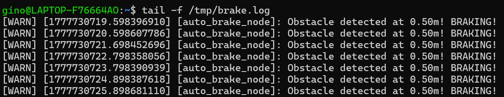
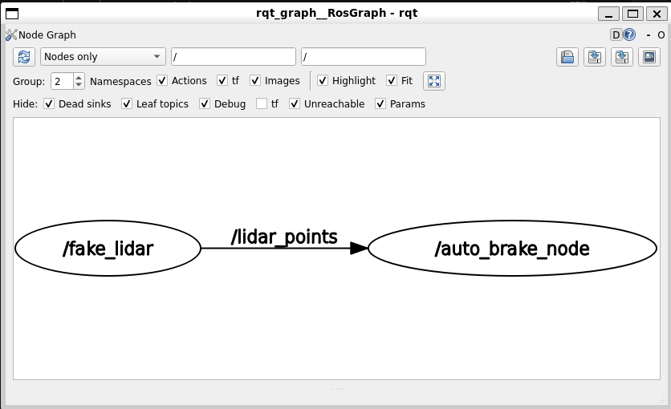
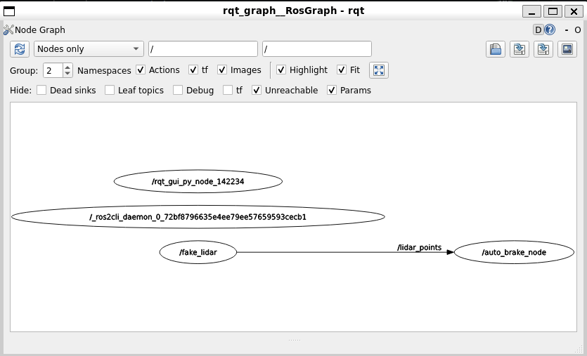

# Phase 03：Subscriber + 光達避障

**學完你會**：寫一個既訂閱（聽光達）又發布（送速度指令）的節點，讓車子偵測到前方障礙物時自動煞車。同時掌握 ROS 2 的 QoS 概念。

**前置**：[Phase 01](../phase-01-cloud-env-first-publisher/) 與 [Phase 02](../phase-02-communication-concepts/)。

**產出**：[`code/my_cpp_pkg/`](code/my_cpp_pkg/) — 可獨立編譯的套件，含 `auto_brake` 執行檔。

---

## 👁️ 核心觀念：機器人的眼睛 (LiDAR)

光達（LiDAR）像蝙蝠的超音波，發射雷射並接收反射來測量距離。ROS 2 中常見兩種訊息格式：

| 格式 | 維度 | 用途 |
|------|------|------|
| `sensor_msgs/msg/LaserScan` | 2D | 平面陣列，依角度紀錄距離。簡單。 |
| `sensor_msgs/msg/PointCloud2` | 3D | 成千上萬個 (X, Y, Z) 點。複雜但能看立體空間。 |

本章使用配備 Livox 3D 光達的 OriginBot，資料頻道為 `/livox/lidar`，格式為 `PointCloud2`。

---

## 🕵️ 步驟 1：終端機偵探課（必做）

寫程式前先排查頻道狀態，避開 90% 的「靜默失敗」。

```bash
# 1. 確認光達有在發送（檢查心跳）
ros2 topic hz /livox/lidar

# 2. 確認資料格式
ros2 topic info /livox/lidar
```

預期看到 Type 是 `sensor_msgs/msg/PointCloud2`。這決定 C++ 程式要 include 的標頭檔。

---

## ⚠️ 關鍵知識：QoS（Quality of Service）

ROS 2 的 Publisher 和 Subscriber 之間必須**達成 QoS 協議**才能成功通訊。如果不匹配，訂閱會「靜默失敗」（沒有錯誤訊息，但收不到資料）。

| 場景 | 預設 QoS | 一致性 |
|------|----------|--------|
| 一般訊息（如 `cmd_vel`） | **Reliable**（可靠） | 不丟封包 |
| 感測器訊息（光達、相機） | **Best Effort**（盡力而為） | 允許丟封包，換取低延遲 |

**規則**：訂閱感測器資料**必須**用 `rclcpp::SensorDataQoS()`，否則收不到。

---

## 💻 步驟 2：撰寫 3D 點雲自動煞車節點

**任務**：監聽 `/livox/lidar`，解析正前方 40 公分寬走廊內的點雲。最近的點 < 1.0 m 就煞車，否則維持 0.2 m/s 前進。

完整程式見 [`code/my_cpp_pkg/src/auto_brake.cpp`](code/my_cpp_pkg/src/auto_brake.cpp)：

```cpp
#include "rclcpp/rclcpp.hpp"
#include "geometry_msgs/msg/twist.hpp"
#include "sensor_msgs/msg/point_cloud2.hpp"
#include "sensor_msgs/point_cloud2_iterator.hpp"

using std::placeholders::_1;

class AutoBrakeNode : public rclcpp::Node
{
public:
    AutoBrakeNode() : Node("auto_brake_node")
    {
        publisher_ = this->create_publisher<geometry_msgs::msg::Twist>("cmd_vel", 10);

        // ⚠️ 感測器一定要用 SensorDataQoS()
        subscriber_ = this->create_subscription<sensor_msgs::msg::PointCloud2>(
            "lidar_points", rclcpp::SensorDataQoS(),
            std::bind(&AutoBrakeNode::cloud_callback, this, _1));

        RCLCPP_INFO(this->get_logger(), "3D Auto Brake Started!");
    }

private:
    void cloud_callback(const sensor_msgs::msg::PointCloud2::SharedPtr msg)
    {
        auto twist_msg = geometry_msgs::msg::Twist();
        float min_forward_distance = 100.0f;

        sensor_msgs::PointCloud2ConstIterator<float> iter_x(*msg, "x");
        sensor_msgs::PointCloud2ConstIterator<float> iter_y(*msg, "y");

        for (; iter_x != iter_x.end(); ++iter_x, ++iter_y) {
            float x = *iter_x;
            float y = *iter_y;

            // 篩選正前方 40cm 寬走廊
            if (x > 0.0f && std::abs(y) < 0.2f) {
                if (x < min_forward_distance) min_forward_distance = x;
            }
        }

        if (min_forward_distance > 1.0f) {
            twist_msg.linear.x = 0.2;
            RCLCPP_INFO_THROTTLE(this->get_logger(), *this->get_clock(), 1000,
                "Clear ahead (Closest: %.2fm)", min_forward_distance);
        } else {
            twist_msg.linear.x = 0.0;
            RCLCPP_WARN_THROTTLE(this->get_logger(), *this->get_clock(), 1000,
                "Obstacle at %.2fm! BRAKING!", min_forward_distance);
        }

        publisher_->publish(twist_msg);
    }

    rclcpp::Publisher<geometry_msgs::msg::Twist>::SharedPtr publisher_;
    rclcpp::Subscription<sensor_msgs::msg::PointCloud2>::SharedPtr subscriber_;
};

int main(int argc, char * argv[])
{
    rclcpp::init(argc, argv);
    rclcpp::spin(std::make_shared<AutoBrakeNode>());
    rclcpp::shutdown();
    return 0;
}
```

> **與原筆記的差異**：
> 1. Topic 用相對名稱 `cmd_vel`、`lidar_points`，由執行時 remapping 對應實際 topic（不寫死）。
> 2. `RCLCPP_*_THROTTLE`：每秒最多印一次 log，避免 spam。

---

## 步驟 3：CMakeLists.txt 與 package.xml

完整版見 [`code/my_cpp_pkg/CMakeLists.txt`](code/my_cpp_pkg/CMakeLists.txt) 與 [`code/my_cpp_pkg/package.xml`](code/my_cpp_pkg/package.xml)。

關鍵新增：

```cmake
find_package(sensor_msgs REQUIRED)

add_executable(auto_brake src/auto_brake.cpp)
ament_target_dependencies(auto_brake rclcpp geometry_msgs sensor_msgs)
```

```xml
<depend>sensor_msgs</depend>
```

---

## 步驟 4：編譯與執行

> 兩種環境的差異只在「remap 到哪個 topic」。完整環境比較見 [SETUP.md](../SETUP.md)。

### ☁️ TheConstructSim（OriginBot + Livox 3D 光達）

```bash
cd ~/ros2_ws
colcon build --packages-select my_cpp_pkg
source install/setup.bash

ros2 run my_cpp_pkg auto_brake --ros-args \
  -r cmd_vel:=/originbot_1/cmd_vel \
  -r lidar_points:=/livox/lidar
```

### 💻 本機 WSL2（turtlebot3 + Gazebo）

turtlebot3 預設配 2D LaserScan（`/scan`），不是 PointCloud2。**有兩個做法**：

**做法 1：改用 LaserScan 版本**（推薦，turtlebot3 原生支援）

把 `auto_brake.cpp` 的 `PointCloud2` 換成 `sensor_msgs::msg::LaserScan`，改用 `msg->ranges` 陣列做避障。本章先聚焦 PointCloud2，LaserScan 版可參考[官方範例](https://docs.ros.org/en/humble/Tutorials/Beginner-Client-Libraries/Writing-A-Simple-Cpp-Publisher-And-Subscriber.html)當作練習。

**做法 2：用 Gazebo 的 depth camera 模擬 3D 點雲**（接近原本程式）

```bash
# Terminal 1: 起 Gazebo + turtlebot3 (waffle 版本內建深度相機)
export TURTLEBOT3_MODEL=waffle
ros2 launch turtlebot3_gazebo turtlebot3_house.launch.py

# Terminal 2: 看 PointCloud2 topic 名稱
ros2 topic list | grep -i point
# 通常會看到 /intel_realsense_r200_depth/points 之類的

# Terminal 3: 跑程式（替換成你看到的實際 topic 名稱）
ros2 run my_cpp_pkg auto_brake --ros-args \
  -r lidar_points:=/intel_realsense_r200_depth/points
```

---

## 🎉 成功指標

- 終端機印出車子前進中的距離資訊。
- 接近牆壁（< 1.0m）時 terminal 顯示黃色 `[WARN]`，車子煞車。

### 看 BRAKING log 在 terminal 滾動

最直接的「程式正在工作」證明——`tail -f /tmp/brake.log`（或 `ros2 run` 直接看 stdout）：



> ⏱️ 仔細看 timestamp：`...720`、`...721`、`...722`...，**每筆間隔約 1 秒**。這就是 code 裡 `RCLCPP_WARN_THROTTLE(... 1000 ...)` 的效果——光達其實每秒進來 10 筆訊息，但 throttle 過濾後 log 只印 1 筆。沒有 throttle 你的 terminal 會被洗版。

### 用 rqt_graph 看通訊架構

開另一個 terminal 跑 `rqt_graph`，**取消預設的 Hide 設定後**會看到：



> **預設 Hide: Dead sinks / Leaf topics / Debug 都勾選時看到的乾淨主鏈路**——`fake_lidar` 透過 `/lidar_points` 把 PointCloud2 送給 `auto_brake_node`。
>
> 注意 `auto_brake_node` 雖然也發 `/cmd_vel`，但因為**沒人訂閱 cmd_vel**（這個 demo 沒接 turtlesim/Gazebo），那條 topic 被 Hide: Dead sinks 藏起來了。

把 Hide 全部取消勾選後：



> 多出兩個節點：
> - `/rqt_gui_py_node_142234` — **rqt_graph 自己也是一個 ROS Node**！它就是訂閱整個 graph 才能畫出來
> - `/_ros2cli_daemon_...` — `ros2 node list`、`ros2 topic list` 這些 CLI 用的常駐 daemon
>
> 預設 `Hide: Debug` 把這兩個藏起來避免畫面雜訊，但學習階段看一眼有助理解「ROS 工具鏈也都用同樣的 ROS 通訊機制做出來的」。

---

## 🌟 挑戰

修改 `auto_brake.cpp`，偵測到障礙物時不要原地煞車，而是 `twist_msg.angular.z = 0.5` 自動轉彎，做出真正的「避障巡邏」。

---

## 下一步

學會了 Topic 雙向通訊。但 Topic 是「持續廣播」，如果想下達「單次且需要確認」的指令（如開關功能）呢？
- [Phase 04 — Services 開關](../phase-04-services-toggle/)

---

<sub>🐍 想用 Python (rclpy) 寫同一個 Subscriber + 光達避障？看 [python/](python/)。含 NumPy 向量化加速版。</sub>
