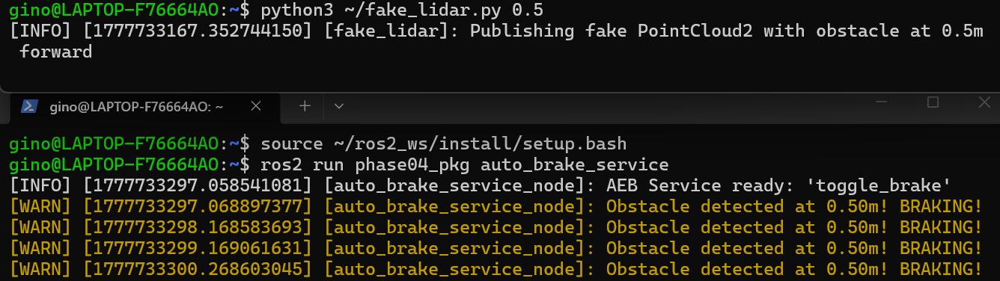
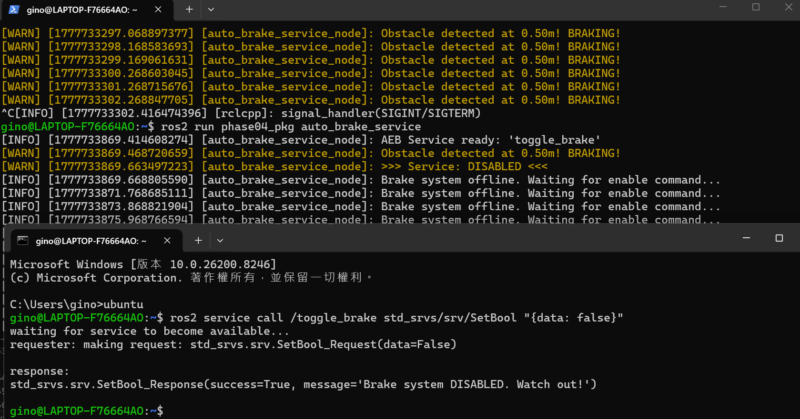

# Phase 04：Service Server + 開關

**學完你會**：實作一個 ROS 2 Service Server，可以用 CLI 從外部下達單次指令切換功能（在這裡是開關避障）。理解 Service vs Topic 的差異。

**前置**：[Phase 03](../phase-03-subscriber-lidar-brake/) — 已能跑光達避障。

**產出**：[`code/my_cpp_pkg/`](code/my_cpp_pkg/) — 含 `auto_brake_service` 執行檔，同時是 Subscriber + Publisher + Service Server。

---

## 🧠 核心觀念：Topic vs Service

| 模式 | 比喻 | 適合的場景 |
|------|------|-----------|
| **Topic（發布/訂閱）** | 廣播電台。沒人聽也持續播。 | 感測器資料、連續控制指令 |
| **Service（一問一答）** | 打電話點餐。有請求才有回應。 | 開關功能、單次計算、拍照 |

Service 包含兩個角色：
- **Server（提供者）**：接電話的人。收到 Request → 處理 → 回 Response。
- **Client（呼叫者）**：打電話的人。送 Request → 等 Response。

本章把 Phase 03 的避障改造為 Service Server，提供外部開關。

---

## 💻 步驟 1：撰寫帶 Service 的節點

使用 ROS 2 內建的 `std_srvs/srv/SetBool`：Request 是布林、Response 是 `success`+`message`。

完整程式見 [`code/my_cpp_pkg/src/auto_brake_service.cpp`](code/my_cpp_pkg/src/auto_brake_service.cpp)：

```cpp
#include "rclcpp/rclcpp.hpp"
#include "geometry_msgs/msg/twist.hpp"
#include "sensor_msgs/msg/point_cloud2.hpp"
#include "sensor_msgs/point_cloud2_iterator.hpp"
#include "std_srvs/srv/set_bool.hpp"
#include <atomic>
#include <cmath>

using std::placeholders::_1;
using std::placeholders::_2;

class AutoBrakeServiceNode : public rclcpp::Node
{
public:
    AutoBrakeServiceNode() : Node("auto_brake_service_node")
    {
        publisher_ = this->create_publisher<geometry_msgs::msg::Twist>("cmd_vel", 10);

        subscriber_ = this->create_subscription<sensor_msgs::msg::PointCloud2>(
            "lidar_points", rclcpp::SensorDataQoS(),
            std::bind(&AutoBrakeServiceNode::cloud_callback, this, _1));

        // 建立 Service Server
        service_ = this->create_service<std_srvs::srv::SetBool>(
            "toggle_brake",
            std::bind(&AutoBrakeServiceNode::toggle_brake_callback, this, _1, _2));

        RCLCPP_INFO(this->get_logger(), "AEB Service ready: 'toggle_brake'");
    }

private:
    // ⚠️ 用 atomic：之後切到 MultiThreadedExecutor 時，兩個 callback 可能在不同 thread
    std::atomic<bool> is_brake_active_{true};

    void toggle_brake_callback(
        const std::shared_ptr<std_srvs::srv::SetBool::Request> request,
        std::shared_ptr<std_srvs::srv::SetBool::Response> response)
    {
        is_brake_active_ = request->data;
        response->success = true;
        response->message = is_brake_active_
            ? "Brake system ENABLED."
            : "Brake system DISABLED. Watch out!";
        RCLCPP_WARN(this->get_logger(), ">>> Service: %s <<<",
                    is_brake_active_ ? "ENABLED" : "DISABLED");
    }

    void cloud_callback(const sensor_msgs::msg::PointCloud2::SharedPtr msg)
    {
        if (!is_brake_active_) {
            RCLCPP_INFO_THROTTLE(this->get_logger(), *this->get_clock(), 2000,
                "Brake system offline. Waiting for enable command...");
            return;
        }

        auto twist_msg = geometry_msgs::msg::Twist();
        float min_forward_distance = 100.0f;
        sensor_msgs::PointCloud2ConstIterator<float> iter_x(*msg, "x");
        sensor_msgs::PointCloud2ConstIterator<float> iter_y(*msg, "y");

        for (; iter_x != iter_x.end(); ++iter_x, ++iter_y) {
            float x = *iter_x;
            float y = *iter_y;
            if (x > 0.0f && std::abs(y) < 0.2f) {
                if (x < min_forward_distance) min_forward_distance = x;
            }
        }

        if (min_forward_distance > 1.0f) {
            twist_msg.linear.x = 0.2;
            twist_msg.angular.z = 0.0;
        } else {
            twist_msg.linear.x = 0.0;
            twist_msg.angular.z = 0.0;
            RCLCPP_WARN_THROTTLE(this->get_logger(), *this->get_clock(), 1000,
                "Obstacle detected at %.2fm! BRAKING!", min_forward_distance);
        }
        publisher_->publish(twist_msg);
    }

    rclcpp::Publisher<geometry_msgs::msg::Twist>::SharedPtr publisher_;
    rclcpp::Subscription<sensor_msgs::msg::PointCloud2>::SharedPtr subscriber_;
    rclcpp::Service<std_srvs::srv::SetBool>::SharedPtr service_;
};

int main(int argc, char * argv[])
{
    rclcpp::init(argc, argv);
    rclcpp::spin(std::make_shared<AutoBrakeServiceNode>());
    rclcpp::shutdown();
    return 0;
}
```

> **與原筆記的差異**：
> 1. Topic 用相對名稱（`cmd_vel`、`lidar_points`），Service 也用相對名稱（`toggle_brake`）。沒有 namespace 時，執行後會看到 `/cmd_vel`、`/lidar_points`、`/toggle_brake`。
> 2. `is_brake_active_` 改成 `std::atomic<bool>`。**為什麼**：預設 `SingleThreadedExecutor` 通常不會 race，但之後如果切到 `MultiThreadedExecutor`，service callback 與 sub callback 可能在不同 thread，普通 `bool` 會造成 race condition。這裡先養成共享狀態用 `atomic` 或 mutex 的習慣。

---

## 步驟 2：CMakeLists.txt 與 package.xml

完整版見 [`code/my_cpp_pkg/CMakeLists.txt`](code/my_cpp_pkg/CMakeLists.txt) 與 [`code/my_cpp_pkg/package.xml`](code/my_cpp_pkg/package.xml)。

關鍵新增：

```cmake
find_package(std_srvs REQUIRED)

add_executable(auto_brake_service src/auto_brake_service.cpp)
ament_target_dependencies(auto_brake_service
  rclcpp geometry_msgs sensor_msgs std_srvs)

install(TARGETS
  auto_brake_service
  DESTINATION lib/${PROJECT_NAME}
)
```

```xml
<depend>std_srvs</depend>
```

> `install(TARGETS ...)` 很重要：`colcon build` 後，`ros2 run my_cpp_pkg auto_brake_service` 是從 install space 找執行檔。少這段常見症狀是 build 成功，但 `ros2 run` 找不到 executable。

---

## 🚀 步驟 3：編譯與實戰測試

> 兩種環境的差異只在「remap 到哪個 topic」。完整環境比較見 [SETUP.md](../SETUP.md)。
> TheConstructSim 的 OriginBot 場景已有 `/livox/lidar`，本機 WSL2 如果沒有真 PointCloud2，需參考 [Phase 03](../phase-03-subscriber-lidar-brake/) 的做法，或使用你放在 `~/fake_lidar.py` 的假光達腳本。

### 第一次準備 workspace

如果你是從這份筆記 repo 跑範例，先把本章套件放進 ROS 2 workspace。若 `~/ros2_ws/src/my_cpp_pkg` 已經存在，先跳過下面的 `cp`，改看下一段的合併提醒。

```bash
mkdir -p ~/ros2_ws/src

# 在 phase-04-services-toggle 目錄執行
cp -r code/my_cpp_pkg ~/ros2_ws/src/
```

如果 `~/ros2_ws/src/my_cpp_pkg` 已經存在，請把本章的 `src/auto_brake_service.cpp`、`CMakeLists.txt`、`package.xml` 合併進既有套件，不要盲目覆蓋自己前面章節改過的檔案。

### 編譯（兩種環境通用）

```bash
cd ~/ros2_ws
colcon build --packages-select my_cpp_pkg
source install/setup.bash
```

之後每開一個新 terminal，都要先執行 `cd ~/ros2_ws && source install/setup.bash`，否則 `ros2 run` 或 `ros2 service call` 可能找不到你的套件與型別。

### ☁️ TheConstructSim：啟動 Server

```bash
ros2 run my_cpp_pkg auto_brake_service --ros-args \
  -r cmd_vel:=/originbot_1/cmd_vel \
  -r lidar_points:=/livox/lidar
```

### 💻 本機 WSL2：準備 PointCloud2，再啟動 Server

本機 TurtleBot3 預設多半是 2D LaserScan（`/scan`），不是本章需要的 PointCloud2。若你用 `~/fake_lidar.py` 製造假障礙物，流程會變成三個 terminal：

**Terminal 1：發假光達**

```bash
python3 ~/fake_lidar.py 0.5
```

**Terminal 2：啟動 Server**

```bash
# 如果你用 fake_lidar.py，它預設發到 /lidar_points，不需要 remap lidar_points
ros2 run my_cpp_pkg auto_brake_service
```

如果你是用 Phase 03 的 TurtleBot3 waffle + Gazebo RealSense 做法，改用這個啟動指令：

```bash
ros2 run my_cpp_pkg auto_brake_service --ros-args \
  -r lidar_points:=/intel_realsense_r200_depth/points
```

### Terminal 3：呼叫 Service 關閉避障（兩種環境通用）

先確認 service 有被註冊出來：

```bash
ros2 service list | grep toggle_brake
ros2 service type /toggle_brake
```

預期看到 `/toggle_brake`，型別是 `std_srvs/srv/SetBool`。接著在另一個 terminal 呼叫：

```bash
ros2 service call /toggle_brake std_srvs/srv/SetBool "{data: false}"
```

要重新啟動避障，把 `false` 改成 `true` 再呼叫一次。

> 注意：這裡的「關閉避障」是讓本節點停止處理光達並停止發布新的 `cmd_vel`，不是送出一筆停車命令。如果前一筆速度命令還被下游控制器短暫保留，機器人可能不會立刻停住。真機安全邏輯通常會另外設計速度 timeout 或 emergency stop。

> 💡 進階：用 `rqt_service_caller`（GUI 版本）也可以呼叫，下一階段 Phase 05 會教。

---

## 📊 系統日誌解讀

成功後會看到三個情境清楚展示 Topic（持續）vs Service（突發）：

> 下面截圖使用本機 `fake_lidar.py 0.5` 示範，所以會固定看到 0.50m 障礙物。TheConstructSim 連真模擬光達時，距離數字會依場景變化。

### 情境 1：正常避障（System ENABLED）



> 上方 Terminal 1 是 `fake_lidar.py`，每 0.1 秒往 `/lidar_points` 發一筆「障礙物在 0.5m」的 PointCloud2。
> 下方 Terminal 2 是 `auto_brake_service`，每秒 throttle 出一筆 `BRAKING` warning。`is_brake_active_` = true，光達持續觸發 callback，發送速度 0.0。

```
[WARN] [auto_brake_service_node]: Obstacle detected at 0.50m! BRAKING!
[WARN] [auto_brake_service_node]: Obstacle detected at 0.50m! BRAKING!
```

### 情境 2 & 3：Service 呼叫瞬間 + 進入休眠



> 一張圖看完整個 Service 通訊故事——
>
> **下半 Terminal 3** 跑 `ros2 service call /toggle_brake std_srvs/srv/SetBool "{data: false}"`：
> - `requester: making request: SetBool_Request(data=False)` ← Client 端送 request
> - `response: SetBool_Response(success=True, message='Brake system DISABLED. Watch out!')` ← Server 回 response
>
> **上半 Terminal 2** 同步看到狀態切換：
> - 一連串 `BRAKING`（System ENABLED 期間）
> - 中斷一行 `>>> Service: DISABLED <<<`（toggle_brake_callback 被觸發那瞬間）
> - 之後變成 `Brake system offline. Waiting for enable command...`（cloud_callback 還在被光達觸發，但因為 `is_brake_active_=false` 直接 return）

訊息範例：
```
[WARN] >>> Service: DISABLED <<<                                ← 攔截到 service call
[INFO] Brake system offline. Waiting for enable command...      ← 進入休眠
[INFO] Brake system offline. Waiting for enable command...
```

🎯 **這就是 Service vs Topic 的對照**：
- **Topic（光達 PointCloud2）**：持續廣播，`cloud_callback` 每秒被觸發 10 次（即使在休眠狀態）
- **Service（toggle_brake）**：只在被呼叫的「那一瞬間」執行 `toggle_brake_callback` 一次

---

## 🎯 學到的關鍵概念

- **Service = Request-Response 一問一答**，與 Topic 的廣播模式對立
- **Service callback 簽章**：`(Request, Response)`，回傳值寫進 `Response`
- **多 callback 共享狀態要小心**：用 `std::atomic` 或 mutex
- **CLI 呼叫格式**：`ros2 service call <name> <type> "<data_yaml>"`

---

## 下一步

下一章開始學 **Parameters** — 讓常數（如 `0.2 m/s`、`1.0 m`）可以從外部動態調整，免重新編譯。
- Phase 05 — Parameters（待完成）
