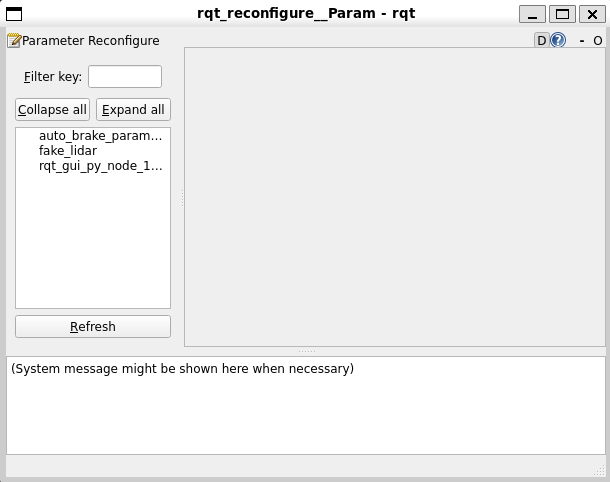
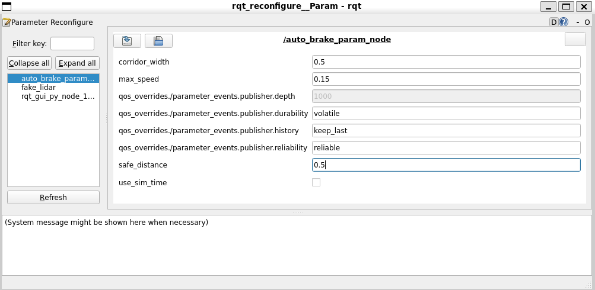
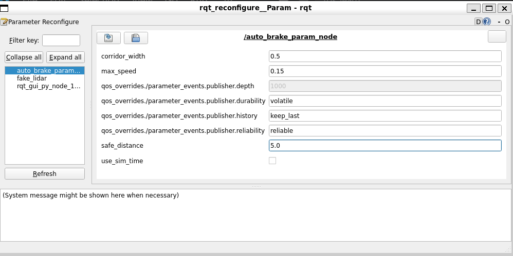

# Phase 06：Parameters（參數系統）

**學完你會**：把寫死在 code 裡的常數變成可從外部調整的 parameter，並用三種方式調它——CLI、YAML 設定檔、`rqt_reconfigure` GUI。再也不用「改一個閾值就重編譯」。

**前置**：[Phase 03](../phase-03-subscriber-lidar-brake/) 的 `auto_brake.cpp`（本章在它之上加 param）。

**產出**：[`code/my_cpp_pkg/`](code/my_cpp_pkg/) — 含 `auto_brake_param` 可執行檔 + `config/auto_brake_params.yaml`。

---

## 為什麼需要 Parameters

看 Phase 03 的 `auto_brake.cpp`：

```cpp
if (min_forward_distance > 1.0f) {     // ← 寫死的安全距離
    twist_msg.linear.x = 0.2;          // ← 寫死的速度
}
```

**痛點**：
- 想試 0.5m 煞車距離 → 改 code → 重編 → 重跑（30 秒）
- 客戶要更慢的速度 → 改 code → 重編 → 重跑
- 不同場地要不同設定 → 維護多份 code？

**Parameters 的解法**：把這些值宣告成 param，**執行中可以改**。

| 你熟悉的 | ROS 2 Parameter |
|---------|----------------|
| 環境變數 (`$DEBUG=1`) | `ros2 param set` |
| `.env` / `config.yaml` | `params.yaml` + `--params-file` |
| Spring Boot `@Value` | `node->get_parameter("name")` |
| Docker `ENV` | Launch file 的 `parameters=[...]` |

---

## 🕵️ 終端機偵探課:看 ROS Node 自帶哪些 parameter

**所有 ROS 2 Node 啟動就自動有內建 parameter**(例:`use_sim_time`)。寫自己的 param 之前先看現有的:

```bash
# 跑任何一個 Node(這裡用 Phase 03 的 auto_brake)
ros2 run my_cpp_pkg auto_brake &

# 看這個 Node 有哪些 param
ros2 param list /auto_brake_node
```

預期看到:
```
/auto_brake_node:
  use_sim_time         ← 內建 param,模擬時用 sim 時間還是 wall time
```

**最重要的內建 param 是 `use_sim_time`**:
- 預設 `false`(用真實時鐘)
- Gazebo / Bag replay 都需要設 `true`(用模擬時間)
- Phase 17 跑 Gazebo、Phase 22A 跑 Nav2 都會碰到

```bash
# 試試看查 / 改 / 觀察
ros2 param get /auto_brake_node use_sim_time
# Boolean value is: False

ros2 param set /auto_brake_node use_sim_time true
# Set parameter successful

ros2 param describe /auto_brake_node use_sim_time
# 看 type、預設值、constraints
```

**這章要做的事**:**自訂自己的 param**(`safe_distance`、`max_speed`、`corridor_width`),取代 Phase 03 寫死的 magic number。學完之後,**你的 Node 也會在 `ros2 param list` 上出現自訂 param**,跟 `use_sim_time` 並列。

---

## 💻 改造 Phase 03

完整檔案見 [`code/my_cpp_pkg/src/auto_brake_param.cpp`](code/my_cpp_pkg/src/auto_brake_param.cpp)。

宣告三個 parameter：

| 名稱 | 預設值 | 用途 |
|------|--------|------|
| `safe_distance` | 1.0 m | 觸發煞車的最小距離 |
| `max_speed` | 0.2 m/s | 前進速度 |
| `corridor_width` | 0.4 m | 偵測走廊寬度 |

關鍵程式碼：

```cpp
// 1. 在建構子宣告
this->declare_parameter<double>("safe_distance", 1.0);
this->declare_parameter<double>("max_speed", 0.2);
this->declare_parameter<double>("corridor_width", 0.4);

// 2. 第一次讀取，快取到成員變數（避免每次 callback 都查表）
safe_distance_ = this->get_parameter("safe_distance").as_double();
max_speed_     = this->get_parameter("max_speed").as_double();
corridor_width_ = this->get_parameter("corridor_width").as_double();

// 3. 註冊變更攔截器（驗證 + 套用新值）
param_callback_handle_ = this->add_on_set_parameters_callback(
    std::bind(&AutoBrakeParamNode::on_param_change, this, _1));
```

攔截器負責驗證新值並更新快取：

```cpp
rcl_interfaces::msg::SetParametersResult on_param_change(
    const std::vector<rclcpp::Parameter> & params)
{
    rcl_interfaces::msg::SetParametersResult result;
    result.successful = true;

    for (const auto & p : params) {
        if (p.get_name() == "safe_distance") {
            double v = p.as_double();
            if (v < 0.0) {                              // ← 驗證
                result.successful = false;
                result.reason = "safe_distance must be >= 0";
                return result;
            }
            safe_distance_ = v;                          // ← 套用
            RCLCPP_INFO(this->get_logger(), "safe_distance -> %.2f", v);
        }
        // max_speed, corridor_width 同理...
    }
    return result;
}
```

> **為什麼要快取**：Callback 每秒被觸發 10 次（光達頻率），每次都 `get_parameter` 會多一層查表。快取 + on_set_callback 才是慣用法。
> **為什麼 callback handle 必須保留**：析構就等於取消註冊，不存的話 callback 不會被呼叫。

---

## 🚀 五個 Demo：見證 Parameters 的威力

### Demo 1：預設值啟動 + CLI 查詢

```bash
# Terminal 1
python3 /tmp/fake_lidar.py 2.0    # 模擬障礙物 2 公尺前

# Terminal 2
ros2 run phase06_pkg auto_brake_param
```

啟動 log：
```
[INFO] Started with: safe_distance=1.00, max_speed=0.20, corridor_width=0.40
[INFO] Clear (closest=2.00m, threshold=1.00m). Speed=0.20
```

CLI 查詢：
```bash
ros2 param list /auto_brake_param_node
ros2 param get /auto_brake_param_node safe_distance
# Double value is: 1.0
```

### Demo 2：CLI 即時改 + 行為立即改變

不關 process、不重編譯：

```bash
ros2 param set /auto_brake_param_node safe_distance 2.5
# Set parameter successful
```

Node log 立刻反應：
```
[INFO] Clear (closest=2.00m, threshold=1.00m). Speed=0.20  ← 改前
[INFO] safe_distance -> 2.50                                ← 攔截器收到
[WARN] BRAKING (obstacle=2.00m < threshold=2.50m)           ← 同樣 2m 障礙物，新閾值下變煞車
[WARN] BRAKING (obstacle=2.00m < threshold=2.50m)
```

🎯 **這就是 Parameters 的核心**——同樣的程式、同樣的環境，只改一個值，行為就改變了。

### Demo 3：驗證攔截器擋壞值

```bash
ros2 param set /auto_brake_param_node max_speed 5.0
# Setting parameter failed: max_speed must be in [0, 2.0]

ros2 param set /auto_brake_param_node safe_distance -1.0
# Setting parameter failed: safe_distance must be >= 0

ros2 param get /auto_brake_param_node safe_distance
# Double value is: 2.5    ← 沒被改成 -1.0，保持 demo 2 的 2.5
```

🎯 **production code 必備的防呆**——使用者打錯值時 Node 不會吃到不合理的設定。

### Demo 4：YAML 載入

寫 [`config/auto_brake_params.yaml`](code/my_cpp_pkg/config/auto_brake_params.yaml)：

```yaml
auto_brake_param_node:           # ← Node 名稱必須完全一致
  ros__parameters:
    safe_distance: 0.8
    max_speed: 0.15
    corridor_width: 0.5
```

啟動時加 `--params-file`：

```bash
ros2 run phase06_pkg auto_brake_param --ros-args \
  --params-file ~/ros2_ws/install/phase06_pkg/share/phase06_pkg/config/auto_brake_params.yaml
```

啟動 log：
```
[INFO] Started with: safe_distance=0.80, max_speed=0.15, corridor_width=0.50
                              ↑              ↑                ↑
                              來自 YAML 而非 declare 的預設值
```

🎯 **這是 production 慣例**——YAML 是 source of truth，code 只放預設值當 fallback。

> ⚠️ **YAML 內 Node 名要對得起來**。`auto_brake_param_node:` 必須 = code 裡 `Node("auto_brake_param_node")` 的字串。打錯名字會被靜默忽略（讀回預設值）。

### Demo 5：rqt_reconfigure GUI 即時拖數值

開 GUI：

```bash
rqt --standalone rqt_reconfigure.param_plugin.ParamPlugin
```

> ⚠️ **不是 `rqt_reconfigure.rqt_reconfigure.RqtReconfigure`** ——那是舊版 plugin 路徑，Humble 找不到會報錯 `qt_gui_main() found no plugin matching`。正確路徑用 `rqt --list-plugins | grep -i reconfig` 找。

開起來會看到所有 Node 的 param 樹：



> 截圖左側清單顯示三個節點：你的 `auto_brake_param`、模擬光達的 `fake_lidar`、rqt 自己的 `rqt_gui_py_node`。中間空白是還沒選 Node。

點 `auto_brake_param_node` 後右側出現所有 param：



> 重點看 `corridor_width=0.5`、`max_speed=0.15`、`safe_distance=0.5`（這張是改完之後狀態）。其他 `qos_overrides.*` 與 `use_sim_time` 是 ROS 2 內建的「隱藏 param」（QoS 動態調整、模擬時間切換）——所有 Node 都會有，可以忽略。

⚠️ **Humble 沒有滑桿**，只有輸入框。雖然 ROS 1 dynamic_reconfigure 有滑桿，ROS 2 改成輸入框反而對 double 更精準。

把 `safe_distance` 改成 `5.0` 並按 Enter：



Node log 立刻變：
```
[WARN] BRAKING (obstacle=2.00m < threshold=5.00m)    ← 從 INFO 變 WARN，從 Clear 變 BRAKING
```

🎯 **不重編譯、不重啟、不關 process，純 GUI 拖數值改 Node 行為**——這是 demo 給老闆看「我可以即時調整機器人」的招牌技。

---

## 🐛 常見雷

### 雷 1：rqt_reconfigure plugin 名稱
Humble 不能用舊版的 `rqt_reconfigure.rqt_reconfigure.RqtReconfigure`，要用 `rqt_reconfigure.param_plugin.ParamPlugin`。

### 雷 2：YAML Node 名打錯
靜默失敗——不會報錯，但 param 值會是 declare 的預設值。**對照 ros2 node list 的名字檢查**。

### 雷 3：忘記保留 callback handle
```cpp
this->add_on_set_parameters_callback(...);  // ❌ 回傳值丟掉
auto h = this->add_on_set_parameters_callback(...);  // ❌ 區域變數，函式結束就析構
self->param_callback_handle_ = ...;  // ✅ 存成員變數
```

### 雷 4：`get_parameter` 在 callback 裡呼叫每次都查表
寫 PID 調參之類高頻場景時會看出效能差。**永遠用「快取 + on_set 更新」模式**。

### 雷 5：型別不對
```cpp
this->declare_parameter<double>("safe_distance", 1.0);
ros2 param set /node safe_distance 2  // ❌ int 不能 set 進 double param
ros2 param set /node safe_distance 2.0  // ✅
```

---

## 🎯 學到的關鍵概念

- **Parameters = Node 內建的設定系統**：宣告、讀取、變更通知都在 ROS 2 框架內
- **三種改 param 的方式**：CLI（測試用）、YAML（production 用）、GUI（demo 用）
- **變更攔截器**：on_set_callback 在值真正被改前執行，可以驗證/拒絕
- **快取模式**：在 callback 高頻場景用快取，不要每次 `get_parameter`
- **YAML 結構**：`<node_name>: ros__parameters: <param>: <value>`

---

## 下一步

學會了治理單一 Node。但實際系統有多個 Node 要一起啟動，總不能每次手動開好幾個 terminal——
- Phase 07 — Mini Capstone 1：把 Param + Service + LiDAR 整合成一個小作品
- Phase 09 — Launch Files：用一行 `ros2 launch ...` 啟動整套系統，自動套 YAML 參數

---

<sub>🐍 Python 版本暫無——`rclpy` 的 Parameter API 跟 rclcpp 概念完全相同，只是 `self.declare_parameter('name', default)` 這樣的寫法。如果有需求再補。</sub>
