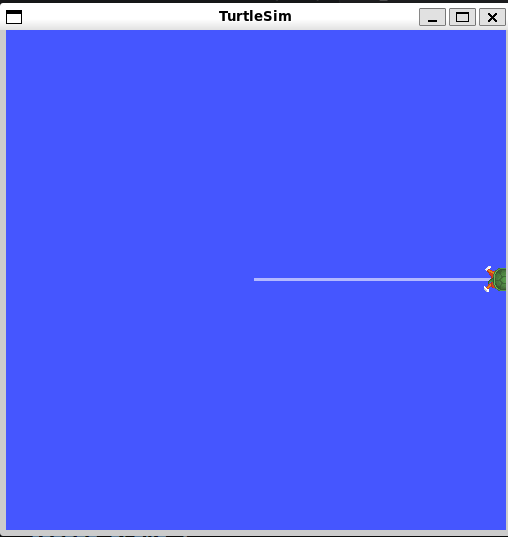
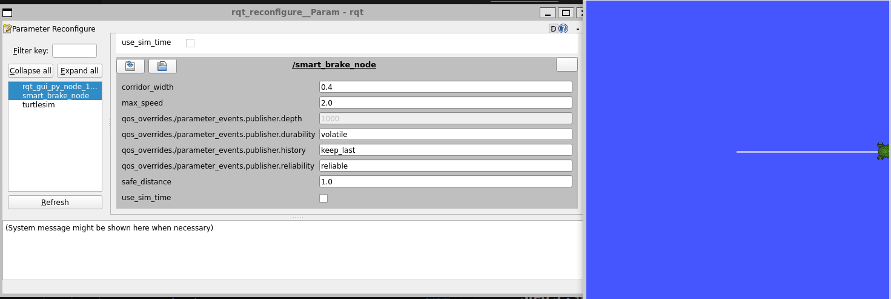
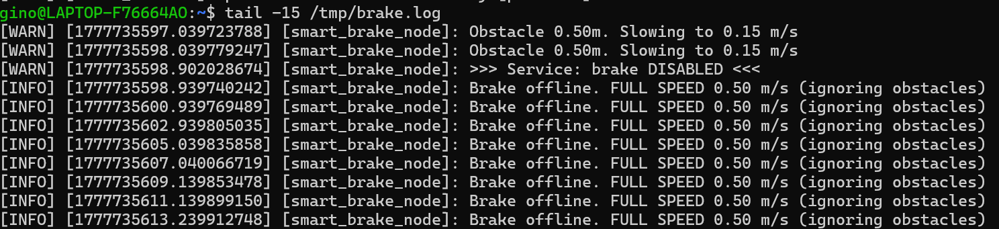

# Phase 07：Mini Capstone 1 — 智能煞車車

**學完你會**：把 Phase 03/04/06 學過的所有東西**整合**成一個能 demo 給人看的小作品——一台可以遠端開關、動態調速、會避障減速的烏龜車。一個下午能完成，github 推上去當 portfolio 沒問題。

**前置**：
- [Phase 03](../phase-03-subscriber-lidar-brake/) — Subscriber + QoS
- [Phase 04](../phase-04-services-toggle/) — Service Server
- [Phase 06](../phase-06-parameters/) — Parameters + on_set_callback

**產出**：
- [`code/my_cpp_pkg/src/smart_brake.cpp`](code/my_cpp_pkg/src/smart_brake.cpp) — 整合節點
- [`code/my_cpp_pkg/launch/capstone.launch.py`](code/my_cpp_pkg/launch/capstone.launch.py) — 一鍵啟動 turtlesim + 你的程式（**Phase 09 launch 預習**）

---

## 為什麼有這章

到 Phase 06 為止你學了 6 個機制（Pub/Sub/Service/QoS/Param/Debug 工具），但都是「**單章 demo**」——學完容易組不起來。

Mini Capstone 1 強迫你把這些東西**塞在同一個 Node 裡**，並設計出一個**有戲劇性的 demo**：拖滑桿改速度、呼叫服務開關、看烏龜真的根據參數動。整合過一次，後面 Phase 08+ 開始學進階主題時你會更踏實。

---

## 🏗️ 架構

```
        Parameters (rqt_reconfigure 即時調)
          ├── max_speed
          ├── safe_distance
          └── corridor_width
                   │
                   ▼
[fake_lidar] ──/lidar_points──▶ [smart_brake_node] ──/cmd_vel──▶ [turtlesim]
                                       ▲
                                       │
[ros2 service call] ──/toggle_brake────┘
```

`smart_brake_node` 同時擔任 **5 個角色**：
1. **Publisher**：發 cmd_vel 控制烏龜
2. **Subscriber**：聽 PointCloud2 算最近障礙物
3. **Service Server**：toggle_brake 開關避障邏輯
4. **Parameter Holder**：三個 param + 變更攔截器
5. **Timer Owner**：每 100ms 根據最新狀態送一次 cmd_vel（不靠光達 callback 觸發，光達掉訊息也照樣動）

---

## 🚀 跟 Phase 04 比，最大的差別

| 面向 | Phase 04 auto_brake_service | Phase 07 smart_brake |
|------|-----------------------------|---------------------|
| 障礙物近時 | 直接 0 速度（停） | **減速到 max_speed × 0.3**（仍移動）|
| 速度怎麼來 | 寫死 0.2 | 從 param `max_speed` 取（可動態調）|
| 安全距離怎麼來 | 寫死 1.0 | 從 param `safe_distance` 取 |
| 啟動方式 | 手動 `ros2 run` | **launch file 一鍵起 turtlesim + node + remap** |
| Demo 時看得到變化 | log 裡看 | **烏龜真的會跑會停會減速** |

「障礙物近 = 減速不停」這個改動很關鍵——**讓烏龜永遠在動**，你拖 max_speed 滑桿才能直觀看到「同樣障礙物下，速度怎麼變」。

---

## 💻 核心程式碼亮點

完整檔案見 [`code/my_cpp_pkg/src/smart_brake.cpp`](code/my_cpp_pkg/src/smart_brake.cpp)。重點：

### 1. 共享狀態用 `std::atomic`

```cpp
std::atomic<double> max_speed_;
std::atomic<double> safe_distance_;
std::atomic<bool> brake_enabled_{true};
std::atomic<double> last_min_distance_{100.0};
```

四種 callback（service / param / lidar / publish timer）會共享這些變數。`atomic` 防止 race condition。

> ⚠️ 編譯雷：`RCLCPP_INFO("...%.2f", max_speed_)` 會踩 `atomic<double>` copy ctor deleted。**要 `.load()`** 顯式取值。
> 我寫第一版就踩了，CMake 報 50 行錯誤。後面所有 atomic 引用都改成 `max_speed_.load()`。

### 2. 三層速度邏輯

```cpp
if (!brake_enabled_) {
    twist.linear.x = max_speed;                  // 開關關 → 全速無視障礙
} else if (dist > safe_distance) {
    twist.linear.x = max_speed;                  // 安全 → 全速
} else {
    twist.linear.x = max_speed * 0.3;            // 障礙物近 → 減速 30%
}
```

三層條件對應你 demo 時看到的三種行為。

### 3. Launch File 預習

[`launch/capstone.launch.py`](code/my_cpp_pkg/launch/capstone.launch.py) 一次啟動兩個 Node + 自動 remap + 設預設 param：

```python
Node(
    package='phase07_pkg',
    executable='smart_brake',
    name='smart_brake_node',
    output='screen',
    remappings=[('cmd_vel', '/turtle1/cmd_vel')],
    parameters=[{
        'max_speed': 0.5,
        'safe_distance': 1.0,
        'corridor_width': 0.4,
    }],
)
```

Phase 09 會深入 Launch File，這裡先嚐到「一行指令啟動一整套系統」的爽快感。

---

## 🎬 Demo 操作劇本

### Step 1：build + 起 launch

```bash
cd ~/ros2_ws
colcon build --packages-select phase07_pkg
source install/setup.bash
ros2 launch phase07_pkg capstone.launch.py
```

turtlesim 視窗自動開啟。烏龜開始**以 0.5 m/s 往前跑**（沒障礙物）。



> 烏龜從 (5.5, 5.5) 一路向右跑到牆邊 (約 11, 5.5)。**留下的白色軌跡長度** = 你的 max_speed 設定 × 移動時間。這條軌跡比 Phase 01 的 0.6m 長很多——因為這次 max_speed=0.5 比 Phase 01 的 0.2 快。

### Step 2：開 rqt_reconfigure 拖 max_speed

新開 terminal：

```bash
rqt --standalone rqt_reconfigure.param_plugin.ParamPlugin
```

點選 `/smart_brake_node`，拖 `max_speed` 試不同值。



> 左側 rqt_reconfigure 顯示 `max_speed=2.0`，右側 TurtleSim **烏龜以 4 倍速度衝向右牆**——軌跡橫跨整個視窗。
>
> 試 `max_speed=6.0` 會被攔截器拒絕（限制 [0, 5.0]）：
> ```
> Setting parameter failed: max_speed must be in [0, 5.0]
> ```

### Step 3：跑 fake_lidar 製造障礙物 + 用 service 切開關

新 terminal：

```bash
# 製造一個 0.5m 前方的障礙物
python3 ~/fake_lidar.py 0.5
```

Smart_brake 收到光達後切換成「障礙物近 → 減速到 max_speed × 0.3」模式。烏龜變慢。

再新 terminal 呼叫 service 把 brake 關掉：

```bash
ros2 service call /toggle_brake std_srvs/srv/SetBool "{data: false}"
```



> **完整的故事在 log 裡**：
> - 上方一連串 `[WARN] Obstacle 0.50m. Slowing to 0.15 m/s` ← brake 啟用、看到障礙物、減速到 30%
> - 中間一行 `[WARN] >>> Service: brake DISABLED <<<` ← 你呼叫 service call 那一刻
> - 下方一連串 `[INFO] Brake offline. FULL SPEED 0.50 m/s (ignoring obstacles)` ← 立刻變回全速
>
> 顏色從黃變黃變白——`RCLCPP_WARN` vs `RCLCPP_INFO` 兩種等級。
>
> **看 timestamp**：DISABLED 那行 `1777735598.902`、下一行 FULL SPEED `1777735598.939`，中間只差 **37 毫秒**——這就是 service 的特性：**一被呼叫立即執行 callback、立即更新狀態、下一個 publish timer (~100ms 內) 就反映新狀態**。

烏龜這時會「**從 0.15 m/s 突然加速到 0.5 m/s**」往牆衝。

### Step 4：把 brake 重新打開

```bash
ros2 service call /toggle_brake std_srvs/srv/SetBool "{data: true}"
```

烏龜立刻又變慢——因為 fake_lidar 還在發 0.5m 障礙物，brake 攔截器接著把 last_min_distance 算進來，又進入減速模式。

---

## 🎯 整合學到的概念

| 來自 | 你在這章用到的部分 |
|------|------------------|
| Phase 01 | Publisher 三要素、Timer-based 發送 |
| Phase 03 | Subscriber + SensorDataQoS + PointCloud2 iterator |
| Phase 04 | SetBool Service + atomic 共享狀態 |
| Phase 05 | （沒用 rqt_graph 但你可以開來看） |
| Phase 06 | declare_parameter + on_set_callback + 驗證攔截器 |

**新東西**：
- 多 callback 共用 atomic 狀態的設計模式
- Timer-driven 發送（不靠 lidar callback 觸發）→ 即使光達靜默仍持續送 cmd_vel
- Launch File 入門（Python launch script 寫 Node + remap + parameters）

---

## 🌟 進階挑戰

寫完核心後可以玩：

1. **加 angular control**：障礙物在右邊就左轉、左邊就右轉。改 corridor 邏輯記錄左右各自最近距離。
2. **加參數 `obstacle_slowdown_factor`**：本章寫死 `0.3`，改成可調 param。
3. **掃過障礙物時逐漸減速**：不是「< safe_distance 直接減 30%」而是「線性內插：dist=safe → 100% 速度，dist=0 → 0% 速度」。
4. **多訂閱 turtle1/pose 看自己軌跡**：寫 callback 算累計移動距離，做為 param 動態加減速依據。

選一個做完，**把 GitHub repo 連結貼到履歷**——這個 demo 已經有「會用 ROS 通訊全套機制 + 知道怎麼整合」的實際證據。

---

## 下一步

進入 **Part 3：系統設計**——從「使用現成 ROS 元件」進到「設計自己的 ROS 系統」：

- [Phase 08 — Custom Interfaces](../phase-08-custom-interfaces/)：定義你自己的 .msg / .srv / .action

---

## 📁 完整檔案結構

```
phase-07-mini-capstone-1/
├── README.md                     ← 本文
├── code/
│   └── my_cpp_pkg/
│       ├── package.xml
│       ├── CMakeLists.txt
│       ├── src/
│       │   └── smart_brake.cpp   ← 整合節點
│       └── launch/
│           └── capstone.launch.py ← 一鍵啟動
└── images/
    ├── turtle_full_speed_trail.png
    ├── rqt_param_max_speed_2.png
    └── smart_brake_log.png
```
