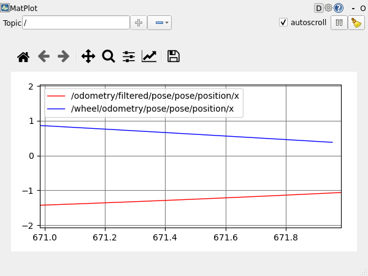

# Phase 20A:Odometry + robot_localization (EKF 融合)

> 這章把**輪式里程計**和 **IMU** 融合成一個更可信的 `/odom`。輪子提供穩定的線速度,IMU 提供較準的角速度,EKF 負責判斷「哪個 sensor 在哪個維度比較值得相信」。

**學完你會**:
- 寫一個 ROS 2 node 發 `nav_msgs/Odometry`,並正確設定 `pose.covariance` / `twist.covariance`
- 寫一個 IMU 發布器,填好 orientation / angular velocity / linear acceleration 三組 covariance
- 用 `robot_localization` 的 `ekf_node` 融合多個 sensor,並寫出可用的 YAML config
- 看懂 EKF 常見失敗原因:missing TF、YAML type、covariance 設錯
- 用實測數據看出 EKF 如何把 wheel-only 的累積誤差壓低到約 **1/8**

**前置**:
- [Phase 16 TF2](../phase-16-tf2/) — EKF 會發 TF + 需要 sensor frame TF
- [Phase 06 Parameters](../phase-06-parameters/) — EKF 用 YAML 設定上百個參數
- [Phase 10 Launch](../phase-10-launch-files-basics/) — 整個 demo 用 launch 啟動 4 個 node

**產出**:
- [`code/my_cpp_pkg/src/fake_wheel_odom.cpp`](code/my_cpp_pkg/src/fake_wheel_odom.cpp) — 假輪式里程計,線速度 +5%、角速度 -15%
- [`code/my_cpp_pkg/src/fake_imu.cpp`](code/my_cpp_pkg/src/fake_imu.cpp) — 假 IMU,角速度準 + 高頻 noise
- [`code/my_cpp_pkg/src/comparator.cpp`](code/my_cpp_pkg/src/comparator.cpp) — 跟「真值」(知道是定速圓周)比較
- [`code/my_cpp_pkg/config/ekf.yaml`](code/my_cpp_pkg/config/ekf.yaml) — EKF 完整 YAML 設定
- [`code/my_cpp_pkg/launch/ekf_demo.launch.py`](code/my_cpp_pkg/launch/ekf_demo.launch.py)

**環境**:☁️💻 雙環境通用。主要流程用 CLI 驗證,也可選擇用 rqt_plot 看曲線。

---

## 🌉 從 Part 4 到 Part 5:為什麼先做 EKF

Part 4 解決的是「機器人的身體長什麼樣」:URDF、TF、Gazebo、ros2_control。

Part 5 開始處理的是「機器人如何理解自己的狀態」。第一步就是把 wheel odometry 和 IMU 變成穩定的位姿估計。

順序是這樣:

```
Part 4 終點          Part 5 起點         Part 5 高潮
─────────────       ─────────────       ─────────────
你會做出機器人 →    你會讓它知道 →     你會讓它自己決定
的物理結構           自己現在在哪        要去哪、怎麼避障
URDF + TF           Odometry + EKF     SLAM + Nav2
                    (本章)              (Phase 21A / 22A)
```

**為什麼 Part 5 第一章是 Odometry + EKF**:
- SLAM 需要知道「現在大概在哪」,才能把 laser scan 放到地圖上
- Nav2 的 AMCL、local planner 也都依賴穩定的 `/odom`
- 所以進 SLAM / Nav2 前,要先學會把 sensor 訊號變成可信的位姿估計

---

## 🎓 觀念速成:Covariance 與 EKF

如果你沒碰過卡爾曼濾波,先抓住這個直覺就夠了:**EKF 不是魔法平均器,它是依照每筆資料的不確定性決定該信誰**。

### 1. Covariance 是什麼?「**這個感測器在這個維度上有多準**」

每個 sensor 都會有誤差,但它們擅長的維度不一樣:

```
輪式 odometry        IMU
─────────────        ───────────
線速度 vx ✅準       線速度 vx ❌靠積分,飄
角速度 wz ❌打滑     角速度 wz ✅gyro 短期準
```

Covariance 就是把「這筆資料有多不確定」寫成數字。
- 數字小(例 `0.001`)= 「這個 measurement 我很有信心」
- 數字大(例 `1000`)= 「這個值參考就好,不要太信」

ROS 的 `Odometry` 和 `Imu` 訊息都有 `covariance` 欄位。**發訊息的人要負責填好它**,不然 EKF 只能用預設值猜,結果通常不會穩。

### 2. EKF 在做什麼?「**用各 sensor 自己最強的那個維度,加權合成**」

```
        ┌────────────────────────────────┐
        │    EKF(extended kalman filter) │
        │                                 │
        │  ┌──────┐    ┌──────┐          │
輪式 →  │  │  vx  │    │  wz  │  ← IMU  │
odom    │  │ 0.001│    │ 0.001│          │
        │  └──────┘    └──────┘          │
        │     ↑           ↑               │
        │  「相信輪式」 「相信 IMU」        │
        │     vx        的 wz             │
        │       ╲       ╱                 │
        │        ▼     ▼                  │
        │     融合後的 (x, y, yaw)         │
        └────────────────────────────────┘
                    │
                    ▼
            /odometry/filtered
```

**EKF 不是單純平均**,而是依照 covariance 做加權。誰在某個 state 上比較可靠,EKF 就讓誰說話大聲一點。

這章的 demo 會讓你看到:時間拉長後,EKF 的累積誤差約只有 wheel-only 的 1/8。

### 3. 你只要會做兩件事

1. **發訊息時把 covariance 填對** — sensor 擅長的維度寫小,不擅長的維度寫大
2. **在 EKF YAML 選對 state** — 例如「吃 wheel 的 `vx`,吃 IMU 的 `wz`」

Jacobian、線性化等數學細節由 `robot_localization` 處理。這章的目標不是推公式,而是學會把 ROS 訊息和 YAML 設定到能穩定融合。

---

## 為什麼這章重要

Nav2 需要一個準確、平滑、不跳變的 `/odom`。這個 `/odom` 通常不是直接相信單一 sensor,而是由 EKF 融合後產生。

但實機上常見的問題:
- **輪式 odometry 打滑** — 機器人卡到地毯邊、轉彎時內外輪轉速比不對 → yaw 累積誤差
- **IMU 長期 drift** — 雖然短期準,角速度積分一兩分鐘就 yaw 偏 5°
- **單一 sensor 都不夠** — wheel 在 yaw 上爛,IMU 在 position 上爛

EKF 做的事,就是把「每個 sensor 各有所長」這件事變成可計算的融合結果。每個 sensor 先用 covariance 表達自己的不確定性,EKF 再用這些資訊產生更穩定的位姿估計。

在實務上,Nav2 專案很常用 `robot_localization` 來產生 `odom→base_link` 這段 TF。先把這段做好,後面的 SLAM / Nav2 才有穩定基礎。

---

## 🏗️ 架構

```
                     ┌──────────────────────────┐
                     │ fake_wheel_odom (20 Hz)  │
                     │ /wheel/odometry          │   ← 線速度 +5%、角速度 -15%
                     │ pose.cov: vx 信任,wz 信任 │
                     └────────────┬─────────────┘
                                  │
                                  ▼
                     ┌──────────────────────────┐
 fake_imu (100 Hz) → │     ekf_node (30 Hz)     │ → /odometry/filtered
 /imu/data           │  Extended Kalman Filter  │   /tf (odom → base_link)
 vyaw 信任,acc 不信 │  融合兩個 sensor 各自最強的 state
                     └──────────────────────────┘
                                  │
                                  ▼
                     ┌──────────────────────────┐
                     │ comparator (1 Hz)        │
                     │ 印出 TRUE / WHEEL / EKF 三者位姿,Δ=與真值距離
                     └──────────────────────────┘
```

`fake_wheel_odom` 和 `fake_imu` 都用同一個「真值」產生資料:定速圓周運動 `(v=0.5, w=0.3)`。不同的是,它們各自加入不同偏差來模擬實機 sensor 的誤差。

EKF 不知道真值。它只能根據兩個 sensor 發出的資料和 covariance,推估出最可能的位姿。

---

## 🕵️ 終端機偵探課:判斷 EKF 有沒有真的融合

EKF 最麻煩的地方是:它常常不會大聲報錯。topic 還在發、node 還活著,但某個 sensor 其實沒被吃進 filter。寫 YAML 前,先用 CLI 建立一套檢查順序。

### 偵探 1:三條資料流都有在跑嗎

先完成後面 Step 1 的部署與 build。若你開了新的 terminal,先 source ROS 環境,再啟動 demo:

```bash
source /opt/ros/humble/setup.bash
source ~/ros2_ws/install/setup.bash
ros2 launch phase20a_pkg ekf_demo.launch.py
```

Terminal 2 看 topic:

```bash
ros2 topic list | grep -E "wheel|imu|filtered|tf"
```

預期至少看到:

```text
/wheel/odometry
/imu/data
/odometry/filtered
/tf
/tf_static
```

接著看頻率。`ros2 topic hz` 會持續輸出,看到穩定數字後按 `Ctrl+C` 停止即可:

```bash
ros2 topic hz /wheel/odometry
ros2 topic hz /imu/data
ros2 topic hz /odometry/filtered
```

預期大約是:

| Topic | 預期頻率 |
|------|----------|
| `/wheel/odometry` | 20 Hz |
| `/imu/data` | 100 Hz |
| `/odometry/filtered` | 30 Hz |

如果 `/odometry/filtered` 沒有輸出,先查 `ekf_node` 是否 crash。如果 wheel / IMU 有輸出但 EKF 結果怪,往下一步查 TF 和參數。

### 偵探 2:IMU frame 能不能轉到 base_link

EKF 要吃 IMU,必須知道 `imu_link` 和 `base_link` 的關係:

```bash
ros2 run tf2_ros tf2_echo base_link imu_link
```

預期看到穩定的 transform,本章 demo 是:

```text
Translation: [0.000, 0.000, 0.000]
Rotation: in Quaternion [0.000, 0.000, 0.000, 1.000]
```

如果這裡一直 timeout,EKF 可能會安靜地丟掉 IMU 訊息。這就是雷 1。

### 偵探 3:EKF 參數真的載進去了嗎

```bash
ros2 param get /ekf_filter_node frequency
ros2 param get /ekf_filter_node two_d_mode
ros2 param get /ekf_filter_node odom0
ros2 param get /ekf_filter_node imu0
```

預期看到:

```text
30.0
True
/wheel/odometry
/imu/data
```

**這章要做的事**:讓 wheel 提供線速度、IMU 提供角速度,再由 EKF 產生 `/odometry/filtered` 和 `odom→base_link`。只要 topic、TF、param 三件事都對,debug EKF 就有方向。

---

## 💻 重點檔案

### 1. fake_wheel_odom.cpp — 輪速資料與 covariance

完整見 [`code/my_cpp_pkg/src/fake_wheel_odom.cpp`](code/my_cpp_pkg/src/fake_wheel_odom.cpp)。

```cpp
auto &pc = msg.pose.covariance;        // 36 元素(6x6 row-major)
pc.fill(0.0);
pc[0]  = 1e-3;  pc[7]  = 1e-3;  pc[14] = 1e6;     // x: 信任,y: 信任,z: 不信
pc[21] = 1e6;   pc[28] = 1e6;   pc[35] = 1e-2;    // roll/pitch 不信,yaw 略信任

auto &tc = msg.twist.covariance;
tc[0]  = 1e-3;  tc[7]  = 1e6;   tc[14] = 1e6;     // vx 非常信任,vy/vz 不信
tc[21] = 1e6;   tc[28] = 1e6;   tc[35] = 1e-3;    // wz 信任(實際打滑的偏差由 EKF 拒絕)
```

這個矩陣是在告訴 EKF:這筆 odometry 哪些欄位可靠,哪些欄位只是形式上存在。

這裡把車子不可能用到的 state,例如 `z`、`roll`、`pitch`,設成 `1e6`,讓 EKF 幾乎忽略;把較可信的速度欄位設成 `1e-3`,讓 EKF 願意使用。

### 2. fake_imu.cpp — IMU 的三個 covariance 很容易設錯

```cpp
msg.orientation_covariance =
  {1e6, 0, 0,  0, 1e6, 0,  0, 0, 1e-2};         // 只信 yaw
msg.angular_velocity_covariance =
  {1e6, 0, 0,  0, 1e6, 0,  0, 0, 1e-4};         // 只信 vyaw,且非常信
msg.linear_acceleration_covariance =
  {1e-1, 0, 0,  0, 1e-1, 0,  0, 0, 1e6};        // 加速度有 noise,姑且信
```

**注意**:IMU 的 covariance 第一個元素如果是 `-1`,代表「整個欄位無效」,不是「這個欄位很不準」。本章明確填 `1e6`,意思是「有讀數,但這個維度不要太信」。

### 3. ekf.yaml — sensor_config 是 15 元素 boolean array

完整見 [`code/my_cpp_pkg/config/ekf.yaml`](code/my_cpp_pkg/config/ekf.yaml)。

```yaml
ekf_filter_node:
  ros__parameters:
    two_d_mode: true        # 鎖死 z / roll / pitch,只融合 x / y / yaw
    publish_tf: true        # EKF 發 odom→base_link

    # ─── sensor 1: wheel ───
    odom0: /wheel/odometry
    odom0_config: [false,false,false,    # x, y, z         — 不吃 wheel 的 absolute 位置
                   false,false,false,    # roll, pitch, yaw — 不吃 wheel 的 yaw(打滑時很爛)
                   true, false, false,   # vx, vy, vz      — ✅ 只吃線速度
                   false,false,false,    # vroll, vpitch, vyaw
                   false,false,false]    # ax, ay, az

    # ─── sensor 2: IMU ───
    imu0: /imu/data
    imu0_config: [false,false,false,
                  false,false,false,
                  false,false,false,
                  false,false,true,      # vyaw — ✅ IMU 角速度比 wheel 準
                  false,false,false]
```

**設計邏輯**很單純:wheel 給 `vx`,IMU 給 `vyaw`。EKF 自己把它們積分成 `x/y/yaw`,並跳過兩個 sensor 各自不可靠的 state。

### 4. ekf_demo.launch.py — 4 個 node 串起來

```python
return LaunchDescription([
    Node(package='tf2_ros', executable='static_transform_publisher',
         arguments=['0','0','0','0','0','0','base_link','imu_link']),
    Node(package='phase20a_pkg', executable='fake_wheel_odom', ...),
    Node(package='phase20a_pkg', executable='fake_imu', ...),
    Node(package='robot_localization', executable='ekf_node',
         parameters=[ekf_yaml]),
    Node(package='phase20a_pkg', executable='comparator', ...),
])
```

`static_transform_publisher` 是這個 demo 的關鍵之一。沒有 `imu_link → base_link` 的 TF,EKF 會找不到 IMU 的座標轉換,然後安靜地丟掉 IMU 訊息。你不一定會看到錯誤,只會看到 EKF 的結果不會轉彎。詳見雷 1。

---

## 🚀 完整 Demo 流程(WSL,驗證過)

### Step 1:部署 + build

```bash
rm -rf ~/ros2_ws/src/phase20a_pkg
cp -r /mnt/d/ros_learn/ros2-learning-notes/phase-20A-odometry-ekf/code/my_cpp_pkg \
      ~/ros2_ws/src/phase20a_pkg
sed -i 's|<name>my_cpp_pkg</name>|<name>phase20a_pkg</name>|' \
      ~/ros2_ws/src/phase20a_pkg/package.xml
sed -i 's|project(my_cpp_pkg)|project(phase20a_pkg)|' \
      ~/ros2_ws/src/phase20a_pkg/CMakeLists.txt
source /opt/ros/humble/setup.bash
cd ~/ros2_ws && colcon build --packages-select phase20a_pkg
```

### Step 2:跑 demo 22 秒

```bash
source ~/ros2_ws/install/setup.bash
timeout 22 ros2 launch phase20a_pkg ekf_demo.launch.py 2>&1 | grep -E 'TRUE|WHEEL|EKF '
```

**驗證過的真實輸出**(車繞圓 16 秒):

```
t=  1.0s | TRUE  x= 0.493 y= 0.074 yaw= 0.300
         | WHEEL x= 0.519 y= 0.070 yaw= 0.255  (Δ=0.027)
         | EKF   x= 0.385 y= 0.048 yaw= 0.237  (Δ=0.111)
t=  5.0s | TRUE  x= 1.662 y= 1.549 yaw= 1.500
         | WHEEL x= 1.960 y= 1.471 yaw= 1.275  (Δ=0.308)
         | EKF   x= 1.711 y= 1.513 yaw= 1.437  (Δ=0.061)  ← EKF 已超越 wheel
t= 10.0s | TRUE  x= 0.235 y= 3.317 yaw= 3.000
         | WHEEL x= 1.124 y= 3.775 yaw= 2.550  (Δ=1.000)
         | EKF   x= 0.339 y= 3.465 yaw= 2.937  (Δ=0.181)  ← wheel 已誤差 1m
t= 16.0s | TRUE  x=-1.660 y= 1.521 yaw= 4.800
         | WHEEL x=-1.682 y= 3.265 yaw=-2.203  (Δ=1.744)  ← wheel 完全跑掉
         | EKF   x=-1.768 y= 1.710 yaw=-1.546  (Δ=0.218)  ← EKF 仍貼近真值
```

### Step 3:結論一覽

| 時間 | wheel-only Δ | EKF Δ | EKF 勝過 wheel |
|------|-------------|-------|----------------|
|  1s | 0.03 m | 0.11 m | EKF 還在收斂 |
|  5s | 0.31 m | 0.06 m | **5×** |
| 10s | 1.00 m | 0.18 m | **5.5×** |
| 16s | 1.74 m | 0.22 m | **8×** |

第一秒 EKF 比 wheel 差,這是正常的:filter 需要幾個 sensor cycle 來收斂初始狀態。

時間拉長後差距就很明顯。wheel-only 的誤差會一路累積,EKF 則靠 IMU 修正角速度,所以 16 秒時誤差只剩 wheel-only 的約 1/8。

也可以用 `rqt_plot` 看兩條曲線的差異:



---

## ☁️ TheConstructSim

ROSject 已預裝 `robot_localization`,流程一模一樣,只需要先把 phase20a_pkg 部署進 ROSject 的 `~/ros2_ws/src/`(用 `git clone` 或 web UI 上傳)。

唯一差異:雲端 `colcon build` 比 WSL 慢(共享資源)。

---

## 🐛 常見雷

### ⚠️ 雷 1:EKF 沒抱怨,但 yaw 永遠不變(IMU 沒被吃)

**症狀**:`/odometry/filtered` 有發,但 `pose.position.x` 線性增加、`yaw` 永遠 0,EKF 完全不會轉彎。

**原因**:IMU 的 `frame_id` 是 `imu_link`,但 TF tree 裡沒有 `imu_link → base_link`。EKF 要先把 IMU 讀數轉到 base frame 才能使用;找不到 TF 時,它可能不明顯報錯,但結果會少掉 IMU 的貢獻。

**解**:launch 加 `static_transform_publisher`:
```python
Node(package='tf2_ros', executable='static_transform_publisher',
     arguments=['0','0','0','0','0','0','base_link','imu_link'])
```
實機要設真實的 IMU 安裝位置(例如 IMU 在車上 0.1m 高 → `'0','0','0.1','0','0','0','base_link','imu_link'`)。

### ⚠️ 雷 2:`Sequence should be of same type` 解析 yaml 失敗

**症狀**:`ekf_node` 啟動立刻 crash:
```
failed to initialize rcl: Couldn't parse params file:
Error: Sequence should be of same type. Value type 'integer' do not belong at line_num 64
```

**原因**:`process_noise_covariance` 是 15×15 = 225 元素 array。如果寫成 `[0.05, 0, 0, ...]`,YAML parser 會把 `0.05` 當 float、後面的 `0` 當 int,但 rcl 要求 sequence 裡所有 element 同型別。

**解**:**統一寫成 float**(加 `.0`):
```yaml
process_noise_covariance: [
  0.05, 0.0, 0.0, ...,    # 所有 0 都寫 0.0
]
```

### ⚠️ 雷 3:EKF 起來就吃 90% CPU

**症狀**:啟動 EKF 後 `top` 看 ekf_node 持續 80–90% CPU,跟你預期的「30Hz 不該那麼貴」差很多。

**原因**:sensor 訊息發太快,例如 IMU 開到 1000 Hz,EKF queue 會處理不完,每個 cycle 都在追資料。

**解**:
1. IMU 發布頻率降到 100–200 Hz(實機上 IMU 通常 200 Hz 上限)
2. EKF YAML 的 `imu0_queue_size` 設小(我們用 10)
3. 確認 `frequency` 不要設太高(30 Hz 對 ROS 已經很高)

### ⚠️ 雷 4:`covariance` 設錯讓 EKF 不信 / 太信

**症狀**:EKF 輸出的 `/odometry/filtered` 比單一 sensor 還爛。

**原因**:EKF 會依照 covariance 加權。對它來說,covariance 幾乎就是「這個值該信幾分」的主要依據。
- 設太小(1e-6)→ EKF 完全相信,即使 sensor 在亂報
- 設太大(1e10)→ EKF 完全忽略,等於沒這個 sensor
- 設成 0 → **可能直接觸發數值不穩定**(矩陣不可逆)

**解**:
- 對你不確定的 state 設 1e6(等同忽略)
- 對你信任的 state,從 1e-3 開始試,看結果調
- **所有非對角元素設 0**(假設 state 之間獨立)

### ⚠️ 雷 5:wsl session 結束 background ros2 launch 被殺

**症狀**:用 `nohup` / `setsid` 把 `ros2 launch` 拉背景,wsl 命令一結束 process 全沒。

**原因**:WSL 2 的 session 行為不像實機 systemd 那樣穩定。當次 `wsl` 命令結束後,同一個 session 裡的 background process 即使 detach,也可能一起被收掉。

**解**:用 `timeout NN ros2 launch ...` 同步跑完,在這 NN 秒內所有 demo 都完成 + 收 log。本章 README 的 demo 用 `timeout 22` 跑滿 16 秒實驗 + 收尾 6 秒。

更穩的解(實機部署用):**寫成 systemd unit + `Restart=always`**,讓系統管理 launch process。

### ⚠️ 雷 6:EKF 啟動初期(< 2 秒)輸出比單一 sensor 還爛

**症狀**:看 EKF 第一秒的 Δ 比 wheel-only 大,以為 EKF 沒在融合。

**原因**:EKF 需要幾個 sensor cycle 才能收斂。剛 init 時,內部 covariance 矩陣還很大,前幾筆 sensor 訊息主要是在把 filter 拉往正確狀態。

**解**:看穩態後的數據,不要拿初始化期的數據比較。教學上明確指出「t<2s 是 init 期」。
真正要看的成功標準是:**t > 5s 後,EKF 是否持續且明顯勝過單一 sensor**。本章在 5 秒後已領先約 5 倍,這才是穩態表現。

---

## 🎯 學到的關鍵概念

| 概念 | 一句話 |
|------|------|
| Odometry 訊息結構 | `nav_msgs/Odometry` 帶 pose + twist + 兩個 36 元素 covariance(6×6) |
| IMU 訊息三個 covariance | orientation / angular_velocity / linear_acceleration,每個 9 元素(3×3) |
| `two_d_mode: true` | 輪式車鎖死 z/roll/pitch,只融合 x/y/yaw,大幅減 EKF 計算 |
| `xxx_config` 15 元素 | EKF 對每個 sensor 用 boolean 矩陣選「吃這個 state 嗎」 |
| `publish_tf` | EKF 自己發 odom→base_link,**記得關掉 sensor 自己發 TF** |
| 缺 IMU TF 是無聲失敗 | 沒 imu_link → base_link 變換,EKF 不會抱怨,只是不用 IMU |
| EKF 勝在累積誤差 | 每個 sensor 短期都還 OK,長期 EKF 拉開差距 8x 以上 |

---

## 🌟 進階挑戰

1. **加 GPS** — 用 `navsat_transform_node` 把 GPS lat/lon 轉成 odom frame,EKF 第三個 sensor。實機戶外用 EKF + GPS 是 Nav2 標準做法
2. **改成 UKF** — `robot_localization` 也提供 `ukf_node`(Unscented Kalman Filter),非線性運動更準。比 EKF 慢但對劇烈轉彎更穩
3. **outlier rejection** — 設 `Mahalanobis distance threshold`,自動丟掉跟預測差太多的 sensor 訊息(實機上 IMU 偶爾會出現很離譜的瞬間讀值)
4. **錄 bag + 後處理** — 錄一段真實機器人的 wheel + IMU bag,離線跑 EKF,fine-tune covariance(這是 robotics 工程師日常工作)

---

## 🔗 下一步

- **Phase 21A SLAM** — slam_toolbox 吃 `/odometry/filtered`(本章輸出)+ `/scan` 即時建圖
- **[Phase 16 TF2](../phase-16-tf2/)** — 回頭看 EKF 發的 odom→base_link TF 怎麼跟 map→odom 接上
- **Phase 22A Nav2** — Nav2 的整套 stack 都假設你有一個準確的 EKF odom

---

## 📁 完整檔案結構

```
phase-20A-odometry-ekf/
├── README.md                                ← 本檔案
├── code/
│   └── my_cpp_pkg/
│       ├── package.xml
│       ├── CMakeLists.txt
│       ├── src/
│       │   ├── fake_wheel_odom.cpp           ← 假輪式 odometry,vx +5%、wz -15%
│       │   ├── fake_imu.cpp                  ← 假 IMU,vyaw 準 + noise
│       │   └── comparator.cpp                ← 跟「真值」比較,印出 Δ
│       ├── config/
│       │   └── ekf.yaml                      ← EKF 完整設定(225 元素 process noise)
│       └── launch/
│           └── ekf_demo.launch.py            ← 5 個 node:static_tf + 兩 sensor + ekf + comparator
└── images/
    └── rqt-plot-ekf-vs-wheel-x.png          ← rqt_plot:EKF vs wheel x 曲線
```
