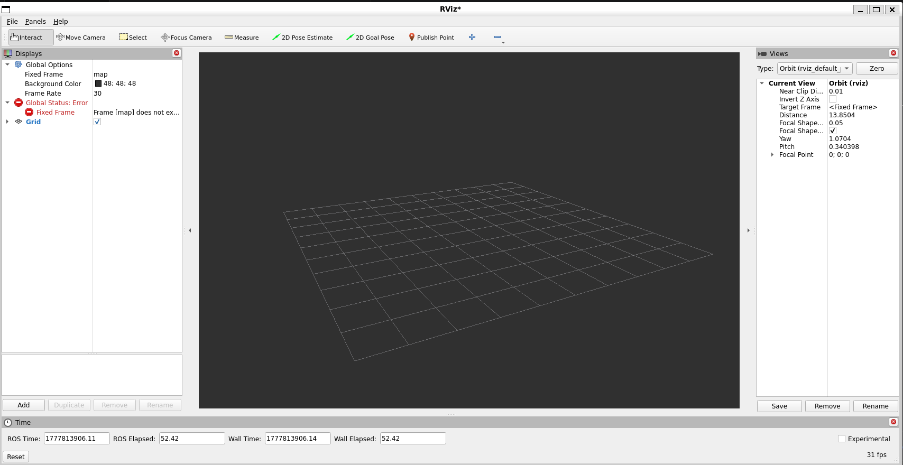
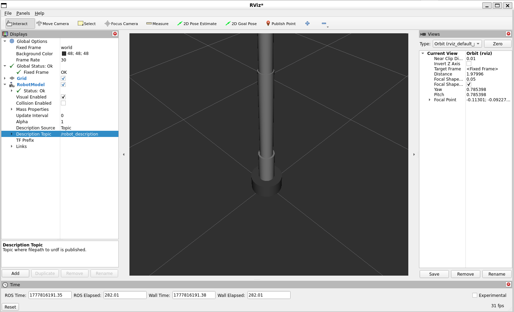
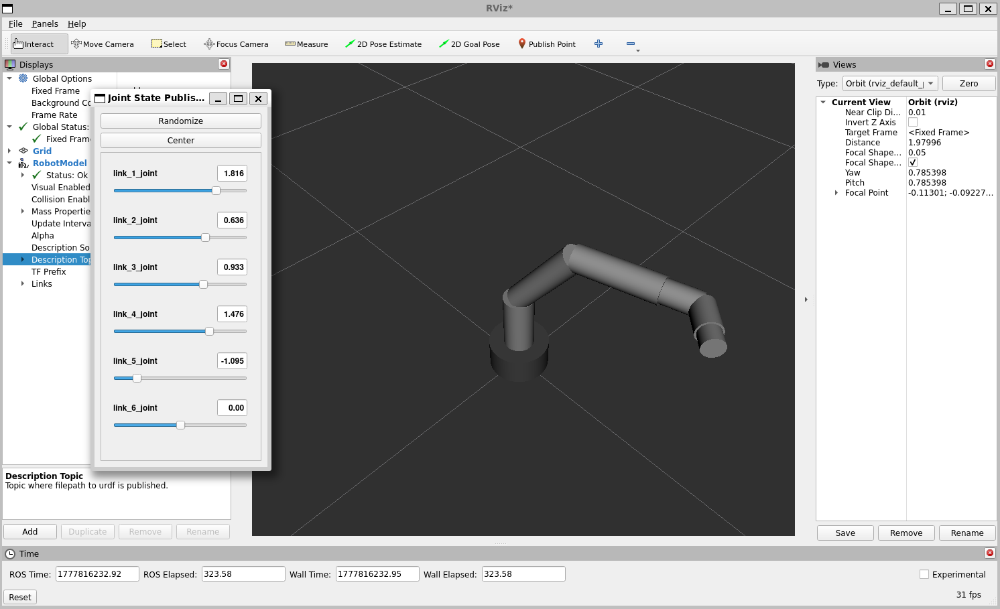

# Phase 20B:手臂 URDF (xacro + SRDF)

> 寫一支 6-DOF 機械手臂的 URDF。用 xacro macro 把 6 個 link+joint 抽出來重複利用,加 SRDF 為將來 MoveIt 鋪路。**Track B(機械手臂)的入口**。

**學完你會**:
- 用 xacro `<xacro:macro>` 把重複的 link+joint pattern 抽成參數化模板
- 用 `xacro:include` 拆檔,主檔只剩設計、巨集另放
- 寫 SRDF(`group`、`group_state`、`disable_collisions`)讓 MoveIt 直接認得
- 在 launch 內展開 xacro,**避開「robot_description 被當 YAML 解析」這個經典雷**
- 用 `check_urdf` 跟 `tf2_echo` 純 CLI 驗證 kinematic chain 是對的

**前置**:
- [Phase 15 URDF](../phase-15-urdf/) — URDF 基礎(link、joint、TF tree)。本章是 URDF 進階版,專攻多 DOF
- [Phase 16 TF2](../phase-16-tf2/) — 驗證 TF tree 用

**產出**:
- [`urdf/arm.macro.xacro`](code/my_arm_description/urdf/arm.macro.xacro) — 抽出的 link+joint macro
- [`urdf/arm.urdf.xacro`](code/my_arm_description/urdf/arm.urdf.xacro) — 主檔,呼叫 macro 6 次組出整支 arm
- [`srdf/arm.srdf`](code/my_arm_description/srdf/arm.srdf) — MoveIt 用的語意描述
- [`launch/display.launch.py`](code/my_arm_description/launch/display.launch.py) — robot_state_publisher + joint_state_publisher

**環境**:☁️💻 雙環境通用(CLI 驗證 + 可選 RViz GUI)

---

## 為什麼這章重要

業界 ROS 機械手臂 URDF 的特徵:
1. **長**——UR5 / Franka / Aubo 每支官方 URDF 都 1000–3000 行
2. **重複**——6 軸幾乎一樣的 pattern 重寫 6 次
3. **多版本**——左右手、不同型號、改 mass、改長度...

不用 xacro **每次改一條尺寸要 sed 6 個地方**。會 macro 之後改一處全部跟著動。

SRDF 是 MoveIt 的「身分證」——告訴 planner 哪個 chain 是 arm、哪個是 gripper、哪兩個 link 不可能撞到(避免 N² collision check)。Track B 後面 Phase 21B 啟用 MoveIt 時這個檔直接套用。

---

## 🏗️ 設計

```
TF 樹(8 個 link、6 DOF + 2 fixed):

  world ──fixed── base_link
                     │ j1: shoulder pan  (z)  ±π
                     ▼
                   link_1
                     │ j2: shoulder lift (y)  ±π/2
                     ▼
                   link_2
                     │ j3: elbow         (y)  ±2.5
                     ▼
                   link_3
                     │ j4: wrist roll    (z)  ±π
                     ▼
                   link_4
                     │ j5: wrist pitch   (y)  ±π/2
                     ▼
                   link_5
                     │ j6: tool roll     (z)  ±π
                     ▼
                   link_6
                     │ fixed
                     ▼
                   tool0  (工具 mounting point)
```

**z/y/y/z/y/z 軸的安排是 6R serial 手臂的常見設計**(典型 spherical wrist),確保 dexterous workspace。

---

## 💻 重點檔案

### 1. arm.macro.xacro — 一個圓柱 link + 連接 joint 的模板

完整見 [`urdf/arm.macro.xacro`](code/my_arm_description/urdf/arm.macro.xacro)。

```xml
<xacro:macro name="arm_link"
             params="name parent length radius axis origin_xyz lower upper">

  <joint name="${name}_joint" type="revolute">
    <parent link="${parent}"/>
    <child link="${name}"/>
    <origin xyz="${origin_xyz}" rpy="0 0 0"/>
    <axis xyz="${axis}"/>
    <limit lower="${lower}" upper="${upper}" effort="100" velocity="1.5"/>
  </joint>

  <link name="${name}">
    <visual>...</visual>
    <collision>...</collision>
    <inertial>
      <mass value="1.0"/>
      <inertia
        ixx="${(1/12) * 1.0 * (3*radius*radius + length*length)}"
        iyy="${(1/12) * 1.0 * (3*radius*radius + length*length)}"
        izz="${(1/2)  * 1.0 * radius*radius}"/>
    </inertial>
  </link>

</xacro:macro>
```

**亮點**:`${...}` 內可以寫運算,所以 `inertia` 直接套用「solid cylinder」公式,改半徑/長度時慣量自動跟著對。手寫 6 次每次都要重算。

### 2. arm.urdf.xacro — 主檔呼叫 macro 6 次

```xml
<xacro:include filename="$(find my_arm_description)/urdf/arm.macro.xacro"/>

<link name="world"/>
<joint name="world_to_base" type="fixed">
  <parent link="world"/>
  <child link="base_link"/>
</joint>
<link name="base_link">...</link>

<xacro:arm_link name="link_1" parent="base_link"
                length="0.20" radius="0.05"
                axis="0 0 1" origin_xyz="0 0 0.10"
                lower="-3.14" upper="3.14"/>

<xacro:arm_link name="link_2" parent="link_1"
                length="0.30" radius="0.04"
                axis="0 1 0" origin_xyz="0 0 0.20"
                lower="-1.57" upper="1.57"/>
<!-- ... 重複 4 次,每次只改參數 -->
```

整個主檔 ~80 行,展開後 URDF **249 行**(實測)。沒 xacro 你得手寫 249 行。

### 3. arm.srdf — 為 MoveIt 鋪路

完整見 [`srdf/arm.srdf`](code/my_arm_description/srdf/arm.srdf)。

```xml
<group name="arm">
  <chain base_link="base_link" tip_link="tool0"/>
</group>

<group_state name="home" group="arm">
  <joint name="link_1_joint" value="0"/>
  ...
</group_state>

<group_state name="ready" group="arm">
  <joint name="link_2_joint" value="-1.0"/>
  <joint name="link_3_joint" value="1.0"/>
  ...
</group_state>

<disable_collisions link1="link_1" link2="link_2" reason="Adjacent"/>
```

**MoveIt 拿到這個檔後**:planner 知道 arm 是 base→tool0 的 chain、可以規劃到 named pose `home` / `ready`、相鄰 link 不檢查碰撞。Track B Phase 21B 啟動 MoveIt Setup Assistant 時,**這個 SRDF 可以直接 import 而不用重新點選**。

### 4. display.launch.py — 在 launch 內展開 xacro

```python
from launch.substitutions import Command
from launch_ros.parameter_descriptions import ParameterValue

robot_description = ParameterValue(
    Command(['xacro ', xacro_file]),
    value_type=str           # ⚠️ 必須這個,不然 launch 會把 URDF 當 YAML 解析失敗
)

return LaunchDescription([
    Node(package='robot_state_publisher',
         executable='robot_state_publisher',
         parameters=[{'robot_description': robot_description}]),
    Node(package='joint_state_publisher',
         executable='joint_state_publisher'),
])
```

`Command(['xacro ', file])` 在 launch runtime 跑 `xacro` 命令,**輸出 string** 餵給 robot_state_publisher。沒 `ParameterValue(..., value_type=str)` 包,launch 會當 YAML parse,看到 `<robot>` 就炸。

---

## 🚀 完整 Demo 流程(WSL,驗證過)

### Step 1:部署 + build

```bash
rm -rf ~/ros2_ws/src/my_arm_description
cp -r /mnt/d/ros_learn/ros2-learning-notes/phase-20B-arm-urdf/code/my_arm_description \
      ~/ros2_ws/src/my_arm_description
source /opt/ros/humble/setup.bash
cd ~/ros2_ws && colcon build --packages-select my_arm_description
```

(URDF 套件不需要改名 — 不是程式語意,本來就是 description package)

### Step 2:展開 xacro 看大小

```bash
source ~/ros2_ws/install/setup.bash
xacro $(ros2 pkg prefix my_arm_description)/share/my_arm_description/urdf/arm.urdf.xacro \
      > /tmp/arm.urdf
wc -l /tmp/arm.urdf
```

驗證過輸出:
```
249 /tmp/arm.urdf
```

xacro 80 行 → 純 URDF 249 行,**減約 70%**。

### Step 3:check_urdf 驗證 chain

```bash
$ check_urdf /tmp/arm.urdf
robot name is: my_arm
---------- Successfully Parsed XML ---------------
root Link: world has 1 child(ren)
    child(1):  base_link
        child(1):  link_1
            child(1):  link_2
                child(1):  link_3
                    child(1):  link_4
                        child(1):  link_5
                            child(1):  link_6
                                child(1):  tool0
```

完整 8-link kinematic chain,沒孤立 link,沒迴圈。**check_urdf 通過 = URDF 結構正確**。

### Step 4:啟動 launch + 驗 TF

```bash
ros2 launch my_arm_description display.launch.py &
sleep 5
ros2 topic list
ros2 run tf2_ros tf2_echo base_link tool0
```

驗證過輸出:
```
=== TOPICS ===
/joint_states
/parameter_events
/robot_description
/rosout
/tf
/tf_static

=== TF base_link -> tool0 ===
- Translation: [0.000, 0.000, 1.100]
- Rotation: in Quaternion (xyzw) [0.000, 0.000, 0.000, 1.000]
```

`Translation [0,0,1.10]` 對應 base_link 之上 link_1+...+link_6+tool0 的高度疊加(0.20+0.30+0.25+0.10+0.10+0.05+0.05 = 1.05 + base 0.05 = 1.10),**算對了**。

### Step 5:RViz 視覺驗證(WSL 驗證過,有截圖)

#### Step 5a:啟動 launch 帶 GUI slider

```bash
ros2 launch my_arm_description display.launch.py gui:=true
# (gui:=true → 啟動 joint_state_publisher_gui,可拉 6 個 joint slider 即時轉動手臂)
# (預設或 gui:=false → joint 全 0,手臂直立)
```

#### Step 5b:另開 terminal 啟動 RViz

```bash
rviz2
```

#### Step 5c:RViz 設定(2 步驟)

**1. Fixed Frame** 改 `world`(預設是 `map` → 紅色 error,看雷 7)
**2. Add → RobotModel** → 展開設 `Description Source: Topic` + `Description Topic: /robot_description`

⚠️ **如果你忘了改 Fixed Frame**,看到的是這樣(空 grid + 紅色 Error):



**設好後**:看到底座 + 直立手臂(home pose,joint 全 0):



#### Step 5d:互動 — 拉 slider 即時轉手臂

`gui:=true` 啟動的 `Joint State Publisher GUI` 視窗有 6 個 slider(`link_1_joint` ~ `link_6_joint`)+ `Randomize` / `Center` 兩個按鈕。

拉 slider → RViz 內手臂對應關節**即時轉動**:



實測畫面:
- `link_1_joint=1.816`(肩膀繞 z 軸轉接近 90°)
- `link_2_joint=0.636`(肩膀往前彎)
- `link_3_joint=0.933`(手肘彎)
- `link_4_joint=1.476`(手腕 roll)
- `link_5_joint=-1.095`(手腕 pitch 往下)
- 整支手臂彎成 L 形,tool0 朝外指向

按 **`Randomize`** 一鍵把 6 joint random 一次,看手臂跳到隨機 pose。
按 **`Center`** 全部歸 0,回到直立 home pose。

---

## 🐛 常見雷

### ⚠️ 雷 1:`Unable to parse the value of parameter robot_description as yaml`

**症狀**:`ros2 launch` 馬上炸:
```
Caught exception in launch: Unable to parse the value of parameter robot_description
as yaml. If the parameter is meant to be a string, try wrapping it in
launch_ros.parameter_descriptions.ParameterValue(value, value_type=str)
```

**原因**:`Command(['xacro', file])` 輸出是 string,但 launch 預設把 parameter 值當 YAML parse,看到 URDF 第一行 `<robot ...>` 就失敗。

**解**:用 `ParameterValue(..., value_type=str)` 明確標型別:
```python
from launch_ros.parameter_descriptions import ParameterValue
robot_description = ParameterValue(
    Command(['xacro ', xacro_file]),
    value_type=str)
```

**錯誤訊息已經明示解法**(這個 launch error message 寫得超清楚)——但 ROS 2 文件大量舊範例還是直接傳 `Command(...)` 不包,你 google 抄到舊範例就會撞牆。

### ⚠️ 雷 2:xacro 沒 macro 6 個 link 各自手寫,改尺寸 6 次

**症狀**:URDF 寫得快,但 review 時主管說「link_3 加長 1cm」→ 你改 visual、collision、inertia(3 個 ixx/iyy/izz 算式)總共 6 個地方。

**解**:用 macro 從一開始,改一個參數整支動。本章 macro 把 inertia 公式內嵌:
```xml
ixx="${(1/12) * 1.0 * (3*radius*radius + length*length)}"
```

### ⚠️ 雷 3:visual / collision / inertial 的 `<origin>` 容易忘

**症狀**:RViz 看手臂 link 都「半截」插在 parent 裡。

**原因**:cylinder 的幾何中心在原點,但你希望底端在 joint 位置 → 必須設 `<origin xyz="0 0 length/2">`。

**解**:macro 內統一處理,不要每個 link 自己寫。

### ⚠️ 雷 4:慣量寫零 / 隨便填,Gazebo 不會抱怨,但機器人在裡面亂飛

**症狀**:Gazebo 啟動後手臂自己彈飛、震盪、卡 joint。

**原因**:`<inertial>` 的 ixx/iyy/izz 是物理模擬必需的物理量。寫成 0 → 質量無限大或無限小,模擬失穩。

**解**:用標準幾何體的解析公式:
- Cylinder: `ixx = iyy = (1/12) m (3 r² + h²)`,`izz = (1/2) m r²`
- Box: `ixx = (1/12) m (h² + d²)` 等
- 不確定就用 mesh 慣量產生器(`compute_inertia_from_mesh`)或設 mass=1, ixx=iyy=izz=0.01 當佔位符,別寫 0

### ⚠️ 雷 5:`disable_collisions` 漏寫,MoveIt 規劃變超慢

**症狀**:MoveIt 規劃個簡單動作要 5 秒以上。

**原因**:沒寫 `disable_collisions` 之前,MoveIt 對每個規劃 step 都檢查 N(N-1)/2 對 link 的碰撞。8 個 link → 28 對。相鄰 link 永遠在一起，根本不需要每步檢查。

**解**:**用 MoveIt Setup Assistant 一次跑 sample-based 分析,自動生成 `disable_collisions` 列表**。手寫只寫 adjacent 的,Setup Assistant 會多找出「永遠不可能撞到」的非相鄰 pair(例如 link_1 跟 link_5 在你的關節限制下永遠不會接觸)。

### ⚠️ 雷 6:`joint_state_publisher` 跟 `joint_state_publisher_gui` 雙發 → 手臂在 RViz 內跳動

**症狀(實測)**:RViz 內手臂在「我拉 slider 的角度」跟「全 0 home pose」之間每秒切換,看起來像**抽筋**。

**原因**:**兩個 source 在搶同一個 `/joint_states` topic** —
- `joint_state_publisher`(launch 預設啟,持續發全 0)
- `joint_state_publisher_gui`(你後來開的,發拉動的值)

兩者輪流 publish,RViz subscriber 收到誰用誰 → 跳動。

**解**:本章 launch 用 `gui` arg 互斥兩者:
```bash
ros2 launch my_arm_description display.launch.py gui:=true   # 只起 GUI 版
ros2 launch my_arm_description display.launch.py             # 預設只起 CLI 版
```

如果你已經誤同時跑了,直接 `pkill -9 -f 'joint_state_publisher$'`(`$` 結尾只殺 non-GUI 版)。

### ⚠️ 雷 7:RViz 開啟後 Fixed Frame 預設是 `map` → 紅色 Error,看不到任何東西

**症狀(實測)**:打開 RViz 看到空 grid,左上 Displays 區塊有紅 ❌ `Fixed Frame: Frame [map] does not exist`。

**原因**:RViz 預設 `Fixed Frame` 是 `map`,但這支手臂沒有 SLAM/Nav2 → 沒有 `/map` frame。本章手臂的 root frame 是 `world`(URDF 內定義)。

**解**:Displays → Global Options → Fixed Frame → 點下拉選 **`world`**(或直接打字)。紅錯誤秒消失。

> 這個雷對「會 ROS 但第一次玩 URDF」的人特別容易踩,因為大家最常從 SLAM/Nav2 教學看 RViz,習慣 Fixed Frame=map。

### ⚠️ 雷 8:`world` link 的存廢

**症狀**:看別人的 URDF 有的有 `world` link 有的沒有。

**規則**:
- **手臂** 通常需要 `world` link + `world→base_link` fixed joint。MoveIt scene、planning frame 都用 `world` 當原點
- **移動底盤** 通常**不要** `world` link,用 `odom→base_footprint→base_link` 結構,讓 SLAM/Nav2 動態維護 odom→base_footprint
- 兩個一起裝(mobile manipulator)用 `world→map→odom→base_footprint→base_link→arm_base_link`

---

## 🎯 學到的關鍵概念

| 概念 | 一句話 |
|------|------|
| `<xacro:macro>` | 把重複 pattern 抽成模板,改一處全動 |
| `<xacro:include>` | 拆 macro 跟主檔,大型 URDF 必用 |
| `${expression}` | xacro 內可寫運算,慣量、長度算式直接內嵌 |
| `<robot>` 內 SRDF | MoveIt 拿 SRDF 知道 chain / named pose / 不撞 link |
| `Command(['xacro', f])` | launch runtime 展開 xacro,但要 `ParameterValue(..., str)` |
| 軸交替 z/y/y/z/y/z | 6R 手臂典型設計,保證 dexterous workspace |

---

## 🌟 進階挑戰

1. **加 gripper**:寫一個 `gripper.macro.xacro`(兩根對稱 prismatic finger),`xacro:include` 進主檔,`group_state` 加 `open` / `closed`
2. **加 IMU/camera link**:在 link_6 上掛感測器 link,fixed joint,寫真實 offset
3. **xacro 條件**:用 `<xacro:if value="${has_gripper}">` 讓主檔可選擇是否帶夾爪
4. **mesh 視覺**:把圓柱換成 OnShape / SolidWorks 匯出的 STL/DAE,實機照片級的視覺
5. **Gazebo plugin**:加 `<gazebo:plugin>` 讓 ros2_control 能驅動,接 Phase 18 的 controller_manager

---

## 🔗 下一步

- **Phase 21B MoveIt 入門**(將來)— 這個 URDF + SRDF 直接進 MoveIt Setup Assistant
- **[Phase 18 ros2_control](../phase-18-ros2-control/)** — 回頭看「URDF 怎麼宣告 hardware」,把這支手臂變成可控制的
- **[Phase 15 URDF 基礎](../phase-15-urdf/)** — 對照看單關節 mobile robot 與多 DOF arm 的 URDF 差異

---

## 📁 完整檔案結構

```
phase-20B-arm-urdf/
├── README.md
├── code/
│   └── my_arm_description/
│       ├── package.xml
│       ├── CMakeLists.txt
│       ├── urdf/
│       │   ├── arm.urdf.xacro            ← 主檔,呼叫 macro 6 次
│       │   └── arm.macro.xacro           ← link+joint macro
│       ├── srdf/
│       │   └── arm.srdf                  ← MoveIt 用,group / named pose / disable_collisions
│       ├── launch/
│       │   └── display.launch.py         ← robot_state_publisher + joint_state_publisher
│       └── rviz/                         ← (之後補:rviz config)
└── images/                              ← (之後補:RViz 截圖)
```
